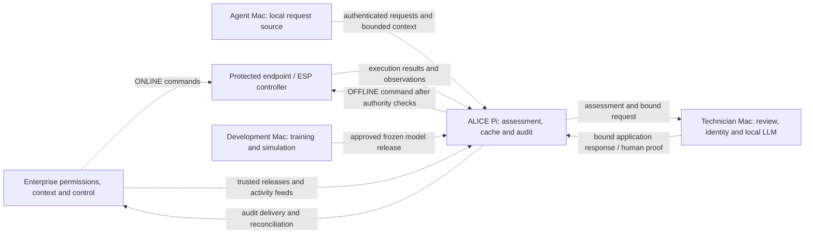
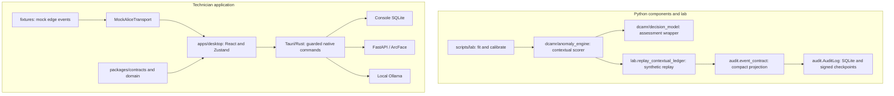
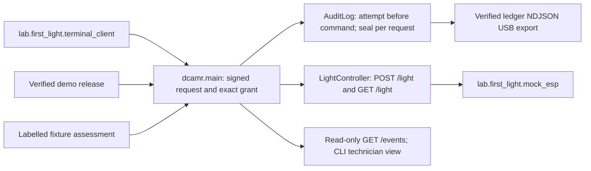

# ALICE architecture

ALICE (Authenticated Local Identity & Cyber Enforcement) is a prototype for
accountable agent operations during enterprise connectivity loss. It combines
permission findings, behavioral assessment, technician review and durable evidence.
DCAMR is the retained name of the Python edge package, not a separate product.

**Current delivery:** a first-light terminal-to-runtime-to-mock-ESP path, tested
assessment/audit components and a native technician console. The first-light path
uses a fixture assessment and demo trust; it is not the complete product or a
physical Pi/ESP acceptance result. This map includes main at `d6e7e55`; [current.md](current.md)
tracks the working checkpoint. The [product architecture specification](docs/prds/ALICE-DCAMR-Architecture.md)
defines target requirements; source links below identify implemented boundaries.

## Read this map

- [Deployment and authority](#deployment-and-authority): where work runs and who controls execution.
- [Operating lifecycle](#operating-lifecycle): online synchronization, offline review and reconnection.
- [Implemented components](#implemented-components): runnable code and its integration limits.
- [Contracts and trust](#contracts-and-trust): what crosses a boundary and what it proves.
- [Storage and model lifecycle](#storage-and-model-lifecycle): trusted inputs, generated evidence and private state.
- [Repository map](#repository-map): active source, preserved scaffolds and placement rules.
- [Integration and acceptance](#integration-and-acceptance): remaining work and verification scope.

## Deployment and authority

The target local network connects the Pi, Agent Mac, Technician Mac and protected
controller through a switch. A router provides enterprise connectivity. Training
runs on a development Mac, which is a deployment role rather than a requirement
for another dedicated physical machine. Network placement alone does not confer trust.

The following is **target topology**. Dashed edges are required integrations;
they are not evidence of working transports or a deployed system.

| Role | Responsibility | Current boundary |
| --- | --- | --- |
| Enterprise | Authoritative permissions, direct online control, relevant context and audit ingestion | Synthetic releases, activity and Wazuh configuration exist. The lab console can query a configured indexer; trusted Pi synchronization and production feed adapters remain. |
| ALICE Pi | Bounded local assessment, accepted cache use, durable audit and offline enforcement coordination | A first-light HTTP runtime authenticates signed terminal requests, resolves exact grants, records audit and commands a mock light. Full service orchestration and physical deployment remain. |
| Agent host | Propose attributable actions and answer bounded context requests | `agent/` is empty scaffolding; a lab terminal client submits signed first-light requests. General agent/delegation integration remains. |
| Technician Mac | Display evidence, explain assessments, authenticate reviewers and submit scoped responses | React/Tauri console, local identity and review controls exist. Live assessment transport and response binding remain. |
| Protected endpoint | Enforce one current controller, execute once and report actual outcomes | `protected_systems/` is scaffolding; a runtime HTTP light client and lab mock ESP exist. Firmware agreement, endpoint fencing and physical acceptance remain. |
| Development Mac | Generate synthetic data, fit/calibrate models and replay components | Implemented in `scripts/lab/`. Generated outputs do not automatically become trusted Pi releases. |

The edge target is a Raspberry Pi 4 Model B with 2 GB RAM and OS Lite. Numerical
training, camera/ArcFace processing and the local LLM stay on Macs. ESP lights and
voltage sensing are the proposed physical demo; device selection, units, operating
limits and sensor contracts remain open. Earlier motor examples are not accepted
hardware requirements. See the [data direction](docs/decisions/2026-09-05-data-direction.md).

## Operating lifecycle

ALICE has exactly two product modes. Connectivity, execution ownership, cache
freshness and audit backlog must be reported separately. The console's existing
`mock`/`remote` settings and DDIL/CONNECTED/DEGRADED display values do not establish
product authority.

| Stage | Required behavior | Implementation state |
| --- | --- | --- |
| ONLINE | Enterprise controls actions directly. Pi synchronizes trusted context, observes authenticated activity and uploads audit/findings. | Enterprise examples and recorder components exist; live lifecycle orchestration remains. |
| Transfer to OFFLINE | Confirm endpoint-enforced ALICE authority, invalidate stale commands/approvals and check cache/model/audit readiness. Ambiguous ownership blocks execution. | Protocol, readiness gate and fencing remain. A network outage alone cannot grant authority. |
| OFFLINE / DDIL | Assess supported local requests using accepted inputs; require review as appropriate; record requests, attempts, results and observations. | First-light wires a signed request, exact grant, fixture assessment, ledger and mock light. Real scoring, review and full product governance remain. |
| Reconnection | Reauthenticate enterprise services, resume audit delivery, append reconciliation, validate cache updates and transfer control back. | Recorder delivery bookkeeping and verified first-light USB export exist; enterprise sender, reconciliation and transfer remain. This is a workflow, not a third mode. |

### One offline request

The sequence below describes the full product integration. The narrower first-light
implementation is documented separately under implemented components.

1. **Authenticate and bind.** A future coordinator attributes the agent to a trusted
   user/delegation and normalizes action parameters. It captures request, permission,
   observation and profile bindings. Agent text and self-reported trust flags are claims.
2. **Resolve permissions.** The first-light resolver supplies exact-match PERMIT findings from a
   signed demo release. The full resolver must also enforce prohibitions, revocations,
   conditions and release validity with package/rule provenance. Model scores do not supply permission.
3. **Assess behavior.** The implemented
   [`assess_for_technician`](dcamr/decision_model.py) validates supplied bindings and
   invokes the contextual scorer. Its `alice-decision-assessment-v1` packet has
   `decision: null`, `explanation: null` and `execution_authorized: false`.
4. **Interpret and review.** A future adapter presents that assessment to the
   technician application. Unusual PRE_ACTION behavior requires human approval;
   hard prohibitions and missing prerequisites remain structured blockers. The
   existing console demonstrates review against a different supplied decision contract.
5. **Authorize and execute.** A future enforcement boundary rechecks current
   permissions, exact parameters, latest assessment, required human proof, durable
   audit readiness and endpoint authority. Approval submission is not execution.
6. **Record outcomes.** Execution attempt, controller result and measured physical
   effect are separate records. POST_ACTION scoring assesses an observation after
   execution; it neither grants retrospective permission nor triggers corrective action.
7. **Reconcile later.** Append new evidence/findings and linked reassessments while
   preserving original records. Delivery acknowledgement does not prove execution.

An agent response must not mutate original scores or evidence. The console already
preserves immutable, linear reassessment history and rejects stale review actions.
A real core challenge/reassessment producer and distributed ordering/replay protocol
remain. See the [HOLD workflow](docs/architecture/hold-workflow.md).

## Implemented components

These are **local code paths**. The first-light runtime is integrated with a mock
controller; the real assessment wrapper and technician console are not connected
to that flow. Solid arrows describe dependencies or a synthetic replay. Native
services need local provisioning.

### First-light request-to-device slice

[`FirstLightRuntime`](dcamr/main.py) serves one test-scoped action,
`set_light_state → ESP-LIGHT-01`. It verifies a signed terminal envelope against
release key/agent bindings, resolves exact PERMIT grants and invokes the additive
`decide()` function. That function allows only verified identity, PERMITTED and an
OK assessment status; all other cases are denied. It is separate from
`assess_for_technician`, which still emits no final decision or authorization.

The happy path records REQUEST, ASSESSMENT, DECISION, EXECUTION_ATTEMPT,
CONTROLLER_RECEIPT, EXECUTION_RESULT and OBSERVED_STATE. Exact fixture bytes are
retained as evidence. Admission checks ledger headroom, and EXECUTION_ATTEMPT is
persisted before dispatch. Completed duplicate requests replay a recorded outcome;
conflicting reuse is rejected. This is test-scale retry evidence, not acceptance
of every crash window or device-enforced exactly-once execution.

The fixture is imported from `lab.first_light` into the runtime and labelled in
retained assessment context. This is an intentional test-slice dependency, not a
production model adapter to copy elsewhere. Authority is hard-coded OFFLINE and
confirmed; there is no real transfer/fence. The HTTP surface lacks production
transport hardening. Human-approval-required grants are denied in this auto-only
slice; no HOLD or technician approval ingestion is implemented.

The light client reads controller state separately from the command receipt.
Mock readback is not independent physical sensor evidence. USB export verifies
ledger event hashes then updates delivery bookkeeping; it is not the enterprise
simulator's audit chain or a live enterprise acknowledgement. See the
[first-light status](docs/reports/2026-09-05-pi-backend-status.md) and
[acceptance tests](tests/test_first_light.py).

### Assessment and behavioral evidence

The [cyber feature builder](dcamr/anomaly_engine/features.py) validates supplied
request/baseline history and produces a fixed 11-feature profile. The
[contextual model](dcamr/anomaly_engine/contextual_model.py) instead consumes named
numeric measurements, units, phases and categorical contexts. PRE_ACTION and
POST_ACTION use separate profiles, observations, forests and held-out normal
references. Neither path is a live sensor collector.

Isolation Forest scores are calibrated normal-tail ranks, not attack probabilities.
Unavailable models, unsupported contexts and invalid/missing observations remain
explicit UNKNOWN/null results. Out-of-training-range evidence survives even when
a learned score is LOW. PRE_ACTION prohibitions skip scoring; POST_ACTION can score
an observed prohibited action while retaining its prohibition flag. Human approval
cannot repair missing evidence or make a hard prohibition permissible.

Mac tools fit models in memory using synthetic normal data and separate calibration
sources. Persistent tree export, lightweight Pi loading, parity checks and real
sensor baselines remain unfinished. See the [contextual model guide](docs/architecture/contextual-behavior-model.md)
and [assessment contract](docs/contracts/decision-assessment.md).

### Technician console and local services

[`apps/desktop`](apps/desktop/package.json) is the active React/TypeScript/Vite UI
and Tauri 2/Rust native app. Shared Zod contracts validate events; domain code
controls HOLD transitions and lineage; Zustand holds presentation/workflow state.
[`RemoteAliceTransport`](apps/desktop/src/lib/transport.ts) fails closed: it supplies
no live event stream and refuses remote context/action submission.

The [native command boundary](apps/desktop/src-tauri/src/commands.rs) guards local
history, technician/admin sessions, enrollment, fresh verification and action
submission. Approval grants are native, single-use, bound to technician/decision/
request and expire after 60 seconds. A successor assessment invalidates old grants.
A local grant is not a remotely verifiable Pi approval proof. Mock receipts explicitly
report `NOT_EXECUTED`.

The [biometric service](services/biometrics/app/main.py) uses FastAPI and
InsightFace/ArcFace with CPU ONNX inference and encrypted enrollment storage.
Login and fresh approval verification are distinct. Facial matching does not
implement liveness, replay resistance or Apple's Face ID.

The local Ollama gateway provides explanations, summaries and informational intent.
Strict output validation constrains shape and referenced evidence, not factual truth.
It has no tool/execution path. Outage produces a structured fallback; it does not
relax review requirements. See the [LLM boundary](docs/architecture/llm-boundary.md)
and [console architecture](docs/architecture/overview.md).

### Durable evidence and enterprise simulation

[`AuditLog`](dcamr/audit/audit_log.py) records canonical events in SQLite with hash
chains, Ed25519 checkpoints, idempotency checks, retained evidence and durable
outbox bookkeeping. It validates an existing store before use. The
[contextual replay](scripts/lab/replay_contextual_ledger.py) exercises scoring,
compact projection, evidence retention, sealing, anchored restart and duplicate retry.
The first-light runtime now produces ledger events using its labelled fixture.
Neither path wires the real technician assessment wrapper to a production producer.

The [enterprise lab](docs/lab/README.md) generates synthetic permission releases,
Wazuh configuration, activity, baseline data and observations. Its local console
compares cached/published state and can query a configured Wazuh indexer. That
access does not implement Pi cache trust, enterprise command ownership or reliable
mission-audit delivery. See the [enterprise simulation record](docs/handoffs/enterprise-sim-handoff.md).

## Contracts and trust

| Boundary | Existing contract/source | Required distinction |
| --- | --- | --- |
| Cyber input/result | [Common JSON schemas](common/schemas/anomaly_result.json), [feature contract](docs/contracts/anomaly-features.md) | Valid structure and digest binding do not authenticate the upstream producer. The action-request schema now pins first-light action/target fields; other generic schemas remain empty scaffolds. |
| Contextual assessment | [Pi assessment](docs/contracts/decision-assessment.md) and [context profiles](docs/architecture/contextual-behavior-model.md) | Supplied permission findings plus measured behavior; no final decision or execution token. |
| Console events/actions | [Zod source](packages/contracts/src/index.ts), generated [event schema](docs/contracts/alice-events.schema.json) | `alice.decision`, context requests, responses and receipts are a separate family. Legacy normalization is not a Pi assessment adapter. |
| Core audit | [Event schema](common/schemas/audit_event.json), [ledger guide](docs/architecture/decision-evidence-ledger.md) | Compact canonical records and retained evidence, distinct from UI history and simulated enterprise envelopes. |
| Application response / controller | [Integration requirements](docs/integration/technician-console.md) | First-light supplies mock HTTP receipt/readback and completed-request replay. Authenticated application proof, endpoint fencing, distributed replay rules and real execution-result contracts remain. |

A shared `alice-audit-event-v1` label does not make the enterprise simulator's
and core ledger's envelopes or hash rules interchangeable. Any adapter must
identify the producer, validate its contract and preserve source provenance.
Existing `policy` keys, `dcamr.*` aliases and `packages/mission_policy` paths remain
compatibility identifiers; use permissions in product language without silently
renaming wire formats.

Renderer input and LLM text cannot create native authority. Local HTTP clients
constrain services to configured loopback endpoints, disable redirects and bound
requests; biometric service credentials stay outside React. This is a local trust
boundary, not protection against a fully compromised same-user host. See the
[threat model](docs/architecture/threat-model.md).

## Storage and model lifecycle

| Data | Location / owner | Lifecycle and limit |
| --- | --- | --- |
| Accepted permissions and normal behavior | Target Pi/USB release inputs | Authenticate source, validate bounded candidate generations and atomically activate compatible releases. First-light verifies a demo manifest signature and payload hashes at startup. Runtime activation, expiry/grace, revocations and rollback policy remain. |
| Core mission evidence | Caller-provisioned protected local SQLite store | Recorder requires durable non-removable storage by deployment policy; detects integrity faults relative to trusted keys/anchors. First-light is a fixture-based producer. Production key/anchor provisioning and real assessment producers remain. |
| Audit delivery | Core ledger's separate delivery state | Retain unacknowledged records and retry without mutating event history. First-light USB export verifies NDJSON before acknowledgement; enterprise sender/ACK protocol and retention policy remain. ACK never authorizes deletion by itself. |
| Console history | Private native SQLite | Identities, immutable decisions, actions, annotations and local audit. Sessions/grants remain native memory. UI/export's latest-500 audit view does not truncate the full decision lineage. |
| Facial identity | Private biometric service model/data directories | Explicit model provisioning and encrypted enrollment; never put camera images, embeddings or service tokens into enterprise decision records. |
| Lab releases and evidence | `artifacts/enterprise-sim/`, generated ignored outputs and `docs/reports/` | Selected synthetic payloads/public verification key are tracked; datasets, signing secrets and fitted/private assets follow ignore rules. Published samples are not production trust roots. |

The proposed removable layout is `permissions/`, `normal_behavior/` and
`audit_logs/`: accepted inputs and generated outputs need different write owners
and retention rules. Folder names do not enforce that separation. Removing USB
must not erase the only authoritative audit copy; quotas, disk-full handling and
fallback acceptance remain deployment work.

A hash chain is tamper evidence relative to a trusted checkpoint. Detecting whole-
store rollback requires an independent anchor. Neither console SQLite nor a
Wazuh role should be described as a complete distributed audit guarantee.

Online updates must not automatically retrain from live activity or technician
approvals. Freeze and version model/profile/reference bindings before deployment;
validate compatibility and parity rather than treating a new file as accepted.

## Repository map

Paths below describe the current layout. New files follow [AGENTS.md](AGENTS.md#file-placement).

| Path | Owns / status |
| --- | --- |
| `dcamr/anomaly_engine/`, `dcamr/decision_model.py`, `dcamr/audit/` | Implemented feature/scoring, assessment, additive first-light decision and ledger code; `anomaly_engine.py` itself remains an empty scaffold. |
| `dcamr/main.py`, `dcamr/packages/package_verifier.py`, `dcamr/policy_engine/policy_engine.py`, `dcamr/enforcement/enforcement_gateway.py` | Implemented first-light HTTP runtime, signed release verification, exact-match resolver and HTTP light client; limited to the test slice. |
| Remaining `dcamr/` modules | Preserved runtime scaffolds for API, challenge, evidence, additional rules/package loading, provenance, state and reconciliation. |
| `common/` | Executable anomaly/audit/first-light request schemas and checkout-root resolution, alongside empty protocol and other generic schema scaffolds. |
| `apps/desktop/` | Active console UI, assets and native Tauri project. Native Rust tests stay with their crate. |
| `packages/contracts/`, `packages/domain/`, `packages/ui/` | Active console schemas/adapters, workflow rules and shared UI. |
| `services/biometrics/` | Active facial identity service, its requirements and service-local tests. |
| `scripts/lab/` | Implemented training, calibration, replays, enterprise generator/console and first-light release builder, fixture, mock ESP, terminal/view/export tools. |
| `scripts/console/`, `scripts/biometrics/` | Launch/build/schema-generation and model/identity helpers; console launcher tests are intentionally colocated. |
| `lab/` | `__init__.py` provides the public `lab.*` namespace pointing to `scripts/lab/`; four empty historical placeholders remain. No second implementation is loaded. |
| `agent/`, `cloud/`, `protected_systems/` | Empty future agent, enterprise connector and protected-device scaffolds. |
| `apps/dashboard/`, `services/backend/`, `services/face_verification/` | Preserved empty legacy application/service scaffolds; use `apps/desktop/` and `services/biometrics/` for active console work. |
| `packages/mission_policy/`, `packages/ops_baseline/`, `packages/tooling/` | Empty legacy release/tool scaffolds. New independent tools belong under `scripts/<area>/`; no empty replacement directories are needed. |
| `tests/`, `tests/console/`, `tests/fixtures/` | Core tests, console unit/browser tests and core examples. Some original core test files remain empty. |
| `fixtures/` | Console mock scenarios, normalized events and byte-preserved legacy examples. |
| `artifacts/` | Selected synthetic release payloads plus ignored generated/private output locations. |
| `docs/` | Detailed architecture, PRDs, contracts, guides, script catalogs, tracker, reports and historical handoffs. Archive contents require explicit permission to read. |
| Root files and `.claude/launch.json` | Project/session entry points, npm/config/lockfiles, Python dependency sets and local development launcher configuration. |

Root `README.md`, `architecture.md`, `AGENTS.md`, `CLAUDE.md` and `current.md` are
the intentional Markdown entry points. Detailed architecture lives under
`docs/architecture/`; existing product architecture/ownership documents retain
their published `docs/prds/` paths. `docs/architecture.md` is a navigation index,
not a second whole-system specification.

Console JSON schema exports intentionally live in `docs/contracts/`, generated
from `packages/contracts/` by `npm run contracts:generate`; Python runtime schemas
remain in `common/schemas/`. Dependency requirement files, generated USB text
markers and the preserved legacy `.txt` payload are not stray Markdown guides.

Npm commands run at the Alice root. Workspaces explicitly include only the desktop
and three console packages. `python -m lab.*` remains the public lab entry point;
use `scripts/lab/run.py` for its listed commands from another working directory.
First-light tools currently require `python -m lab.first_light.<module>` from root. `workstation/`
is no longer a tracked source root. Preserve ignored environments, keys, model
weights and identity stores instead of moving them as source cleanup.

## Integration and acceptance

The [tracker](docs/implementation-tracker.md) owns stable task IDs and detailed
status. The next integration boundaries are:

1. Agree normalized request, permission finding, assessment, application response
   and authoritative execution-result bindings, including identity and replay rules.
2. Implement trusted permissions/cache activation and the service coordinator;
   extend first-light audit admission/production to real assessments and full product lifecycle events.
3. Connect authenticated console transport, remotely verifiable review proof and
   endpoint-enforced single-authority execution, including supersession and retries.
4. Implement reliable enterprise delivery, append-only reconciliation and safe
   handover in both directions, with cache and backlog status kept distinct.
5. Export/load frozen models, agree real sensor profiles and validate Pi/operator
   acceptance under restart, lost connectivity, storage failure and stale inputs.

The [resource specification](docs/prds/ALICE-DCAMR-Architecture.md#12-pi-resource-and-offline-readiness-requirements)
proposes a ≤256 MiB steady scoring worker, ≤384 MiB load peak and p95 ≤100 ms at
one request/second, with bounded queue/deadline behavior. These are unmeasured
acceptance targets, not observed performance or implemented service limits.

The [combined verification record](docs/handoffs/2026-09-05-team-layout-review.md)
separates earlier component/console checks from the integrated first-light merge
verification. These establish component/mock behavior. Native/camera/Pi acceptance
was not rerun at that checkpoint. Use [verification commands](README.md#verify-changes)
for the scope changed; documentation and layout checks do not establish a deployed system.
