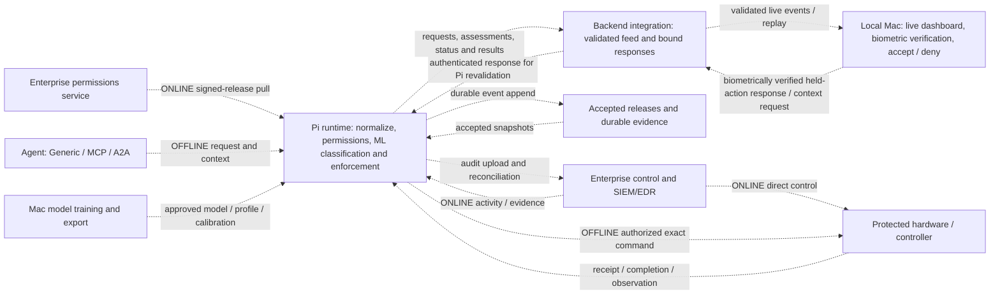

# ALICE architecture

ALICE (Authenticated Local Identity & Cyber Enforcement) governs autonomous-agent
activity when enterprise connectivity is unavailable and preserves a record that
can be reconciled when connectivity returns. DCAMR is the existing Pi runtime
package within ALICE.

This document describes the **intended system and the data flow to build next**,
using [Theo's older Pi runtime plan](docs/plans/2026-09-05-theo-pi-runtime-reference.md)
as design reference and the user's current team direction. The reference's claims
that only anomaly code exists, its old paths, and its embedded build instructions
are historical. They are not current implementation status or authorization to
execute the plan. The user clarified the decision boundary: ML classification runs on the Pi;
the local Mac resolves a held action to accept or deny after biometric verification.
Differences from the newer contracts are identified below.

**Current coordination:** Theo and Jared are configuring the Pi; Xavi is working
on hardware. After the architecture is corrected, Merek will build the backend
integration that carries data end to end, enabling Alex to adapt the workstation
scripts and dashboard to real incoming data. The local live-dashboard slice now connects the real first-light runtime through a
validated read-only bridge; physical Pi acceptance remains pending. See the
[live integration guide](docs/integration/live-dashboard.md).

## System responsibilities

| Component | Role in the intended system | Team coordination |
| --- | --- | --- |
| Enterprise permissions service | Publish signed, versioned permissions and compatible release inputs. Enterprise systems retain direct ONLINE execution control. | Endpoint, issuer and cache contracts need agreement. |
| Enterprise SIEM/EDR | Supply activity and evidence; receive audit/findings. An evidence feed is not permission authority even when hosted alongside the permissions endpoint. | Backend integration must preserve this separation. |
| Agent host | Submit actions and bounded supporting context through Generic, MCP or A2A adapters into one normalized request. | Generic/MCP/A2A breadth remains planned; the current terminal test is narrower. |
| ALICE Pi | Verify accepted inputs, attribute requests, apply permissions/readiness checks, assess behavior, coordinate review/execution and record evidence. | Theo and Jared: Pi configuration underway. |
| Protected hardware/controller | Receive a currently authorized command and report receipt, completion and available observed state separately. | Xavi: hardware work underway; interface/measurements need coordination. |
| Technician workstation | Present Pi classifications/evidence, authenticate the reviewer biometrically and resolve held actions to accept or deny; submit the bound result. | Alex: adapt active workstation scripts and dashboard after the data contract is available. |
| Backend integration | Connect runtime, storage/feed and workstation boundaries with validated, correlated data and bound responses. | Merek: next-session implementation after architecture alignment. |
| Mac training tools | Train/calibrate models and export an approved frozen artifact for lightweight Pi inference. | Coordinate model/profile/export with Jared. |

The Pi target is a Pi 4B, 2 GB RAM, OS Lite. Training, the local LLM and facial
verification remain on Macs. Pi/hardware work being underway does not establish
hardware acceptance in this checkout. See [implemented scope](#implemented-scope).

## End-to-end topology

This diagram describes the **target flow**. Dashed arrows are connections to
complete or accept, not a claim that the full system is connected today.
“Backend integration” is a responsibility across these boundaries; its deployment
host, transport and service split have not been selected by this document.



A shared LAN is connectivity, not execution authority. The protected endpoint must
accept one current controller. Neither a network outage, face match, dashboard
button nor an LLM response can establish that ownership.

## Operating modes

| Mode/workflow | Pi behavior | Execution owner |
| --- | --- | --- |
| ONLINE | Pull and verify signed permissions into the cache; ingest authenticated activity/evidence; append and upload audit. No local action evaluation/authorization in Theo's log-only path. | Enterprise systems control actions directly. |
| Enter OFFLINE / DDIL | Verify local readiness and complete an explicit transfer/fence. Ambiguous ownership or missing prerequisites blocks consequential work. | ALICE only after a confirmed transfer; a simulated lease is demo evidence only. |
| OFFLINE / DDIL | Run the local pipeline from accepted cached permissions/model/context, obtain review as required, record attempts/results and preserve evidence. | The current ALICE authority, enforced at the endpoint. |
| Reconnect | Reauthenticate services, resume delivery, append reconciliation, verify/activate updates and perform fenced handback. Backlog, freshness and ownership remain separate status facts. | Transfer back to enterprise control through the agreed protocol. |

Reconnection is a workflow between two product modes, not a third mode. The Pi's
enterprise synchronization is direct; the technician workstation is not a manual
relay for ordinary policy refresh or audit uploads.

## OFFLINE runtime pipeline

Theo's stage-by-stage plan supplies the intended structure. The table maps each
responsibility to current code or a proposed extension; it does not declare the
full pipeline implemented.

| Stage | Responsibility and output | Existing boundary / work to extend |
| --- | --- | --- |
| 1. Intake and translation | Bound raw input, validate the source envelope and normalize Generic/MCP/A2A into one action shape. | `dcamr/main.py` has signed first-light terminal intake. General adapters and `dcamr/intake/` are proposed. |
| 2. Representation and binding | Resolve identifiers, normalize exact target/arguments and compute a reproducible request digest. Retain original provenance. | Current JSON contracts exist. A versioned codebook/codec is proposed; changing hash bytes requires contract agreement. |
| 3. Identity and attribution | Resolve verified agent → responsible user/delegation → mission using trusted mappings, never agent prose. | First-light binds a verified terminal key to an agent. General identity/delegation resolution remains. |
| 4. Permissions (L1) | Determine permitted, review-required or prohibited with rule/release provenance. Hard prohibition ends the PRE_ACTION path without a model call. | `policy_engine.py` implements exact first-light PERMIT grants; full prohibitions, conditions, revocations and validity remain. |
| 5. Readiness and ownership | Check accepted caches/model, clock/freshness, current authority and durable audit capacity. | First-light checks startup releases and ledger headroom but hard-codes authority. General cache/ownership gates remain. |
| 6. Features and anomaly (L2) | Build compatible features, run the frozen model and calibrate its score; retain UNKNOWN/null on failure. | Cyber/contextual libraries exist. Mac forest export and lightweight Pi loading/scoring remain. |
| 7. Evidence | Resolve cached SIEM/EDR references as available, stale, unverifiable or contradicted. Presence alone is not authenticity. | General evidence acquisition and verification remain. |
| 8. Classification and review routing | Pi emits ML classification, permission findings and blockers. Local Mac resolves held actions to accept or deny after biometric verification. | The assessment-only wrapper fits this split; the authenticated Mac-response path remains to implement. No Pi-owned final fusion for held actions. |
| 9. Bounded challenge/reassessment | Request missing context, pin original behavioral evidence, enforce deadlines/attempt bounds and append a linked successor. | Console fixture workflow/lineage exists; live agent/core producer and routing remain. |
| 10. Provenance and record | Correlate request, assessment, review and execution with exact parameters and source/model/release identities. | Assessment and audit bindings exist; one accepted end-to-end mapping remains. |
| 11. Enforcement and output translation | Revalidate latest authorization, durable intent and authority; translate the exact command to the hardware interface. | `LightController` provides mock-tested HTTP light commands; real device contract/fencing and review integration remain. |
| 12. Result acquisition | Record command receipt, execution completion and available physical observation as distinct facts. | First-light records separate events and mock state readback; actual sensor evidence remains. |
| 13. Audit and delivery | Persist consequential intent before dispatch, append immutable outcomes, seal/checkpoint and queue reliable delivery. | Reuse `AuditLog` and first-light producer/export. Complete recovery, enterprise delivery and retention semantics remain. |

Audit is cross-cutting: stage 13 is not “log everything after execution.” Intent
must be durable before a consequential command. After an uncertain interruption,
record UNKNOWN and reconcile instead of assuming the action never ran or blindly
reissuing it. Hardware idempotency and recovery across every crash window still
need acceptance.

### Decision ownership: Pi classification, Mac review

**User-confirmed boundary:** the Pi runs the ML classification. The local Mac owns
whether a held action is accepted or denied, after biometric verification. The
backend carries this decision and its verification/binding evidence; it does not
move held-action decision-making back onto the Pi.

```mermaid
sequenceDiagram
    participant Pi as Pi: permissions and ML classification
    participant Backend as Backend integration
    participant Mac as Local Mac: review and biometrics
    participant Device as Protected hardware
    Pi-->>Backend: Bound request, classification, evidence and blockers
    Backend-->>Mac: Display current held action
    Mac->>Mac: Biometrically verify reviewer; accept or deny
    Mac-->>Backend: Bound held-action response with verification proof
    Backend-->>Pi: Authenticated response for the same current request
    Pi->>Pi: Validate proof, binding, permissions, authority and audit readiness
    alt Valid accepted response and all prerequisites satisfied
        Pi->>Device: Execute exact authorized command
        Device-->>Pi: Receipt, result and available observation
    else Denied response or invalid prerequisites
        Pi->>Pi: Record blocked/denied outcome; do not execute
    end
    Pi-->>Backend: Durable outcome and correlation
    Backend-->>Mac: Update live history/status
```

The [assessment contract](docs/contracts/decision-assessment.md) already keeps
`decision` and `explanation` null, `execution_authorized` false and
`decision_owner: TECHNICIAN_APPLICATION`. The real Mac response/proof transport
still needs implementation. Local biometric success alone is not a remotely
verifiable execution token; the Pi must validate the bound response and current
execution prerequisites without taking over the Mac's held-action choice.

Theo's older Pi-owned four-state final fusion is superseded **for held-action
resolution** by this clarification. First-light's separate `decide()` remains an
auto ALLOW/DENY test-slice function, not the target held-action review path. A hard
prohibition can block a request before review and cannot be overridden by a low
classification, a face match or a Mac acceptance.

Biometric gating applies to the held-action accept/deny choice described here.
The existing native implementation's approval-focused grant checks are not proof
that both final response paths satisfy this target. Agree their evidence and wire
mapping with Alex (`accept` versus existing APPROVE/APPROVE_ONCE, and `deny` versus
REJECT/DENY) before coding; preserve current identifiers until that mapping is
versioned. Local LLM explanations remain assistance, not biometric proof or an
independent path to authorization.

## Backend integration and the live dashboard

Merek's next work is the data path connecting these components. Alex's dashboard
already has working fixture-driven state, history and review controls; what is
missing is the accepted live integration, not the UI itself.

| Direction | Data the backend must carry | Contract requirement |
| --- | --- | --- |
| Pi → workstation | Normalized request; permission findings; PRE/POST assessment, blockers and provenance | Bind the request bytes/digest to the assessment. Do not invent scores or verification flags. |
| Pi → workstation | Mode/authority, readiness, cache/model freshness, services and audit delivery state | Separate current operational status from facts captured with historical decisions. |
| Pi → workstation | Execution attempt, controller receipt, completion, observation and reconciliation | Preserve their distinct meaning and correlate them to the original request/authority. |
| Workstation → Pi | Context/research request; held-action accept/deny response after biometric verification, with identity/proof and exact assessment binding | Authenticate, reject stale/superseded actions and recheck permission/authority at enforcement. |
| Reconnect/restart | Cursor/replay, duplicate/conflict handling, durable action receipts and history recovery | No duplicate execution, silent lost events, rewritten decisions or old approvals becoming new authority. |

The current `GET /events` endpoint supplies a first-light read-only ledger feed.
It is a starting boundary to inspect, not a drop-in replacement for the console's
`alice.decision` stream. `alice-decision-assessment-v1`, console `alice.*` events,
core ledger records and enterprise-simulator records need explicit validated
mappings. Shared names do not establish interchangeable envelopes or hash rules.

The implemented read-only display boundary uses the versioned runtime feed, a
loopback authenticated bridge and SSH forwarding for physical Pi access. See the
[live integration guide](docs/integration/live-dashboard.md) for configuration,
mapping gaps and recovery. Remote biometric responses still require agreement
and implementation. The empty `services/backend/` directory does not dictate deployment.
The [console integration guide](docs/integration/technician-console.md) retains
native identity, currentness and proof requirements for this work.

## Trusted storage, serialization and models

**Approved storage correction (2026-09-06 UTC):** the USB is the offline SQL data
medium, not merely an export destination. Before DDIL it carries a consistent
synchronized snapshot; during DDIL the Pi appends activity and decisions there.
On reconnect, original events are delivered to SIEM with acknowledgements and
linked reconciliation findings, never rewritten to erase the offline history.


Theo's plan adds useful runtime requirements beyond the earlier inventory. Some
choices are proposals that conflict with the existing implementation and therefore
need an explicit migration decision.

| Area | Design direction from Theo's reference | Reconciliation with current code |
| --- | --- | --- |
| Internal representation | Frozen native records; package-versioned codebook indices; one deterministic CBOR codec at boundaries, JSON for human/console projection. | Current request/assessment/audit paths use JSON-compatible contracts and canonical JSON bytes. CBOR/codebooks are not implemented; preserve old hash/record decoding across any migration. Benchmark size/CPU before claiming the plan's estimates. |
| Signed releases | ONLINE pull → verify signature/digests → stage → validate → atomic activate; OFFLINE uses accepted cached inputs. | First-light verifies a demo release at startup. Full activation, expiry, revocations and rollback handling remain. Evidence feeds cannot become permission authority. |
| Storage isolation | Read-only signed-input partition; distinct writable output storage; secrets outside the signed-input medium. | User-confirmed correction: USB holds the latest synchronized SQL snapshot entering DDIL and the Pi writes new offline audit data onto that USB. The runtime now supports guarded USB SQLite/evidence paths, with the signing key outside USB and no local fallback. Reconciliation preserves original history. Automatic Wazuh delivery now runs through the existing ledger owner on ext4 USB. Enterprise snapshot publication and semantic reconciliation remain; see the [live guide](docs/integration/live-dashboard.md). |
| Audit and outbox | Durable intent before execution; distinguish audit-capacity failure from upload backlog pressure. | Reuse the SQLite/hash-chain/Ed25519 ledger. Do not introduce a second CBOR logger/WAL by assumption. Theo's bounded delivery ring must not discard unacknowledged source history; gap markers are not permission to lose evidence. |
| Signing library | The older plan proposes PyNaCl and rejects cryptography for its target image. | Existing audit and first-light signing use cryptography. No library replacement is approved here; assess compatibility and Pi packaging before changing trust code. |
| Model deployment | Mac-exported, hash-verified forest arrays; pure-Python Pi traversal; no pickle/joblib model loading. | Models currently fit/score in Mac Python components. Export/load and parity are future work. Keep profile, model, calibration and PRE/POST observation bindings explicit. |

The export must reproduce scorer/calibration behavior without changing severity
bands. Theo proposes `atol=1e-9`, `rtol=0` and zero band flips as parity gates;
these are proposed acceptance criteria, not measured parity. Cyber's 11-feature
profile cannot be reused for arbitrary hardware measurements without an agreed
context profile, units, timing and normal data.

Scores are normal-tail ranks, not permission or attack probability. Unknown context,
unavailable models and invalid measurements remain explicit. Out-of-training-range
signals must survive even if the model returns a LOW band.

## Runtime reliability and Pi acceptance

The plan calls for bounded intake/queueing, one scoring worker, per-stage monotonic
timing, explicit clock uncertainty, watchdog/hang recovery and graceful shutdown.
These belong in the target runtime; the current mock slice does not establish them.

- Bound input before parsing, including bytes/depth/key count, and record bounded
  rejection reasons. Theo proposes a 64 KiB envelope cap; retain the existing
  smaller component-specific limits until contracts are reconciled.
- Deadlines and durations use monotonic time. Offline freshness needs an explicit
  uncertainty policy; signed package build time alone is not attestation of current
  time. Missing time confidence must not silently validate an expired cache.
- Watchdog recovery must restore a blocked state until authority is re-established.
  A hung enforcer is a failure, not merely a slow request.
- Exercise crashes between intent, dispatch and result; audit exhaustion; outbox
  backlog; USB removal; bad releases; stale approvals; and authority handover.

Theo's performance targets are p95 ≤100 ms at 1 request/s, steady worker RSS
≤256 MiB, peak ≤384 MiB and startup ≤5 s. Its queue ≤8, 500 ms deadline,
per-stage budgets and burst criteria are design targets to measure on the actual
Pi. They are not current guarantees or proof of whole-device capacity. Model,
codec, crypto, service and hardware choices must be assessed together.

## Implemented scope

The local baseline is `d6e7e55` plus the preserved follow-up at `33b35cf`.
The earlier reference's “only anomaly implemented” statement no longer applies.

| Existing component | What it establishes | What it does not establish |
| --- | --- | --- |
| Anomaly and assessment libraries | Strict feature/context validation, fitted-model experiments, PRE/POST scoring and assessment bindings | Deployable forest artifact, real sensor baselines or the connected Mac held-action response path |
| Durable ledger | USB-configurable SQLite canonical events, hash chain, Ed25519 checkpoints, evidence references and delivery bookkeeping | Complete runtime recovery, production trust provisioning or semantic reconciliation |
| First-light runtime | Signed terminal request, verified demo release, exact PERMIT grant, labelled fixture assessment, durable attempt, mock-light command/readback and USB export | Real scoring, general permissions, real authority transfer, hardware acceptance or workstation integration |
| Technician workstation | React/Tauri UI, fixture transport, immutable lineage, native review guards, local ArcFace/Ollama boundaries | Connected Pi event stream, remote review proof or execution confirmation; remote transport fails closed |
| Enterprise lab | Synthetic releases/activity, Wazuh configuration and development views | Production permissions service or trusted live synchronization |

Prior verification recorded 265 Python tests with zero skips and console checks;
that is historical component/mock evidence. This architecture revision runs
only documentation checks. See the [combined evidence](docs/handoffs/2026-09-05-team-layout-review.md)
and [first-light report](docs/reports/2026-09-05-pi-backend-status.md).

## Repository map

Paths below describe the current layout. New files follow [AGENTS.md](AGENTS.md#file-placement).

| Path | Owns / status |
| --- | --- |
| `dcamr/anomaly_engine/`, `dcamr/decision_model.py`, `dcamr/audit/` | Implemented feature/scoring, assessment, additive first-light decision and ledger code; `anomaly_engine.py` itself remains an empty scaffold. |
| `dcamr/main.py`, `dcamr/packages/package_verifier.py`, `dcamr/policy_engine/policy_engine.py`, `dcamr/enforcement/enforcement_gateway.py` | Implemented first-light HTTP runtime, signed release verification, exact-match resolver and HTTP light client; limited to the test slice. |
| Remaining `dcamr/` modules | Preserved runtime scaffolds for API, challenge, evidence, additional rules/package loading, provenance, state and reconciliation. |
| `common/` | Executable anomaly/audit/first-light request schemas and checkout-root resolution, alongside empty protocol and other generic schema scaffolds. |
| `apps/desktop/` | Active console UI, assets and native Tauri project. Native Rust tests stay with their crate. |
| `packages/contracts/`, `packages/domain/`, `packages/ui/` | Active console schemas/adapters, workflow rules and shared UI. |
| `services/biometrics/` | Active facial identity service, its requirements and service-local tests. |
| `scripts/lab/` | Implemented training, calibration, replays, enterprise generator/console and first-light release builder, fixture, mock ESP, terminal/view/export tools. |
| `scripts/console/`, `scripts/biometrics/` | Launch/build/schema-generation and model/identity helpers; console launcher tests are intentionally colocated. |
| `lab/` | `__init__.py` provides the public `lab.*` namespace pointing to `scripts/lab/`; four empty historical placeholders remain. No second implementation is loaded. |
| `cloud/` | Implemented Wazuh HTTPS delivery adapter and in-process worker; other enterprise connector scaffolds remain. |
| `services/systemd/` | Current demo Pi runtime service configuration; deployment paths are explicit and adaptable. |
| `agent/`, `protected_systems/` | Preserved future agent and protected-device scaffolds. |
| `apps/dashboard/`, `services/backend/`, `services/face_verification/` | Preserved empty legacy application/service scaffolds; use `apps/desktop/` and `services/biometrics/` for active console work. |
| `packages/mission_policy/`, `packages/ops_baseline/`, `packages/tooling/` | Empty legacy release/tool scaffolds. New independent tools belong under `scripts/<area>/`; no empty replacement directories are needed. |
| `tests/`, `tests/console/`, `tests/fixtures/` | Core tests, console unit/browser tests and core examples. Some original core test files remain empty. |
| `fixtures/` | Console mock scenarios, normalized events and byte-preserved legacy examples. |
| `artifacts/` | Selected synthetic release payloads plus ignored generated/private output locations. |
| `docs/` | Detailed architecture, PRDs, contracts, guides, script catalogs, tracker, reports and historical handoffs. Archive contents require explicit permission to read. |
| Root files and `.claude/launch.json` | Project/session entry points, npm/config/lockfiles, Python dependency sets and local development launcher configuration. |

Root `README.md`, `architecture.md`, `AGENTS.md`, `CLAUDE.md` and `current.md` are
the intentional Markdown entry points. Detailed architecture lives under
`docs/architecture/`; existing product architecture/ownership documents retain
their published `docs/prds/` paths. `docs/architecture.md` is a navigation index,
not a second whole-system specification.

Console JSON schema exports intentionally live in `docs/contracts/`, generated
from `packages/contracts/` by `npm run contracts:generate`; Python runtime schemas
remain in `common/schemas/`. Dependency requirement files, generated USB text
markers and the preserved legacy `.txt` payload are not stray Markdown guides.

Npm commands run at the Alice root. Workspaces explicitly include only the desktop
and three console packages. `python -m lab.*` remains the public lab entry point;
use `scripts/lab/run.py` for its listed commands from another working directory.
First-light tools currently require `python -m lab.first_light.<module>` from root. `workstation/`
is no longer a tracked source root. Preserve ignored environments, keys, model
weights and identity stores instead of moving them as source cleanup.

## Next session: backend integration handoff

1. **Confirm architecture and contracts:** preserve Pi ML classification and Mac
   biometric-gated held-action resolution; record normalized request, assessment/event,
   accept/deny proof and hardware-result mappings.
   Treat codec/storage/library changes as explicit proposals, not prerequisite rewrites.
2. **Coordinate readiness:** Theo and Jared report Pi configuration; Xavi supplies
   the hardware interface and measurement constraints. Record what is simulated,
   available and still blocked before choosing the connected test.
3. **Merek builds the backend data path:** reuse the runtime, ledger and accepted
   contracts; implement validated live delivery, correlated history and response
   handling with authentication/replay requirements agreed first.
4. **Alex connects the workstation:** adapt scripts, transport and dashboard state
   to those live contracts, preserving native identity, lineage and stale-action guards.
5. **Validate one connected flow:** request → permission/assessment → live display →
   permitted response → authorized hardware attempt → result/observation → durable
   history. Then extend context/reassessment, offline recovery and enterprise sync.

These are next steps, not implementation completed by this document. The
[session handoff](docs/handoffs/2026-09-05-theo-architecture-alignment.md) records
source differences, current owners and the next-session boundary. Detailed product
tasks remain in the [tracker](docs/implementation-tracker.md).

Current physical USB/Wazuh deployment and ESP/technician connection recommendations:
[team handoff](docs/integration/esp-handoff.md). Automatic audit delivery
does not implement authority transfer or technician accept/prevent commands.
