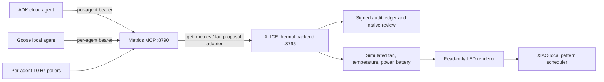

# Machine-metrics integration topology

Current software path after upstream `237c307`; no claim that services are deployed.
The previous host-specific map is [preserved](../handoffs/2026-09-06-before-metrics-reconciliation.md).

`get_metrics` and `set_fan_speed(value)` are the agent-facing interface. There is no
MCP-to-serial path in this demo, and no direct file write authorizes a fan change.
The thermal process is the sole serial owner. See the
[configuration, credentials and units](../guides/machine-metrics-integration.md).

Ports retained: metrics :8790, Goose UI :8791, external agent-loop console :8792,
Decision-Brief MCP :8793, external intro prototype :8794, thermal backend :8795,
Ollama :11434, ADK web :8000. First-light runtime deployments remain a separate
legacy configuration; do not run them on the same serial device as the thermal demo.

SSH tunnels connect local loopback endpoints across Macs/Pi. Live cloud model
execution, hardware deployment and the future cloud-outage storyline are separate
acceptance work, not consequences of merging this adapter.
