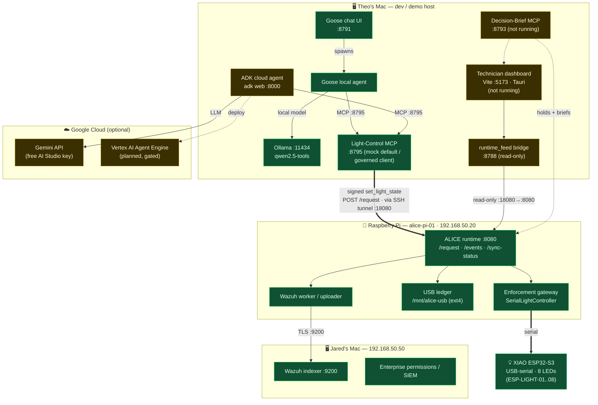

# Where everything runs — deployment topology (2026-09-06)

Maps the hosts behind [STATUS.md](STATUS.md): which agents / MCP servers / ALICE
runtime live where, and how they talk. These are **physical hosts** (two Macs, a
Pi) + one USB device + optional Google Cloud — not VMs.

## Host / process map

| Host | Runs today | Planned / optional |
| --- | --- | --- |
| **Theo's Mac** (dev/demo) | Goose agent, chat UI `:8791`, Light MCP `:8795` (mock), Ollama `:11434` | ADK cloud agent (`adk web :8000`), dashboard (Vite `:5173`), `runtime_feed :8788`, Brief MCP `:8793` |
| **Raspberry Pi** `alice-pi-01` (`192.168.50.20`) | ALICE runtime `:8080`, enforcement + `SerialLightController`, USB ledger, Wazuh worker | Light MCP in `esp` mode could run **here** instead (direct serial, bypasses gate) |
| **XIAO ESP32-S3** | 8 LEDs over **USB-serial to the Pi** (no IP, no network) | real power-grid schema |
| **Jared's Mac** (`192.168.50.50`) | Wazuh indexer `:9200`, enterprise permissions/SIEM | — |
| **Google Cloud** | Gemini API (free AI Studio key) — called by the ADK agent | Vertex AI Agent Engine deploy (gated behind human checkpoint) |

## The one that moves: the Light MCP
- **`mock`** (now) — on the Mac, no hardware, no Pi.
- **`alice`** (recommended) — MCP stays on the **Mac**, signs requests, and lets **ALICE on the Pi** decide/enforce/audit → light. Only needs to *reach* the Pi (SSH tunnel `:18080`→Pi `:8080`).
- **`esp`** (bench) — MCP runs **on the Pi** and drives the XIAO over serial directly; bypasses the ALICE gate.

_Green = running/verified · dashed amber = planned or not yet started._
