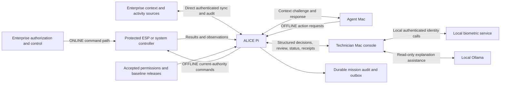

# ALICE: repository state, zero-trust architecture, and upgrade-prompt context

**Snapshot date:** 2026-09-05  
**Repository baseline:** `ea4a2105aa9d6e2887009841f1656114bb785a39` (`main`)  
**Purpose:** a detailed, source-grounded handoff for writing subsequent implementation prompts.  
**Scope:** the entire ALICE repository, with additional detail for the technician console and proposed facial-authenticity upgrade.  
**Document type:** implementation inventory, architecture synthesis, gap register, and planning brief. This is not a claim of a deployed or certified zero-trust system.

## Navigation

- [1. How to use this document](#1-how-to-use-this-document)
- [2. Product scope and non-negotiable invariants](#2-product-scope-and-non-negotiable-invariants)
- [3. Repository and delivery state](#3-repository-and-delivery-state)
- [4. Planned physical and logical architecture](#4-planned-physical-and-logical-architecture)
- [5. Zero-trust model: trust must be established at each boundary](#5-zero-trust-model-trust-must-be-established-at-each-boundary)
- [6. Technician console: implemented architecture and behavior](#6-technician-console-implemented-architecture-and-behavior)
- [7. Current facial identity implementation](#7-current-facial-identity-implementation)
- [8. Proposed facial-authenticity upgrade — planning only](#8-proposed-facial-authenticity-upgrade--planning-only)
- [9. Core anomaly and model state](#9-core-anomaly-and-model-state)
- [10. Console/core contract integration](#10-consolecore-contract-integration)
- [11. Enterprise, storage, telemetry, and audit implementation plan](#11-enterprise-storage-telemetry-and-audit-implementation-plan)
- [12. Operational configuration and known launch incident](#12-operational-configuration-and-known-launch-incident)
- [13. Verification evidence and its limits](#13-verification-evidence-and-its-limits)
- [14. Future work register and recommended sequencing](#14-future-work-register-and-recommended-sequencing)
- [15. Decisions that must not be guessed](#15-decisions-that-must-not-be-guessed)
- [16. Team coordination and prompt-writing rules](#16-team-coordination-and-prompt-writing-rules)
- [17. Integrated acceptance scenario to build toward](#17-integrated-acceptance-scenario-to-build-toward)
- [18. Source catalog and original tracker snapshot](#18-source-catalog-and-original-tracker-snapshot)

## 1. How to use this document

Read sections 2–6 before constructing an upgrade prompt. Then select the relevant subsystem, contract, security, and acceptance sections. Include the source files listed for that milestone, not just this summary. Recheck Git and those files before implementing: this is a dated snapshot, not a permanently current specification.

The user's current instruction is to compile planning context. The requested live facial recognition and deepfake-detection upgrade has **not** been authorized for implementation in this documentation task. Do not interpret a roadmap, proposed interface, or acceptance test below as permission to start that work automatically.

### 1.1 Evidence labels

| Label | Meaning |
| --- | --- |
| **Implemented** | Executable code exists at the stated boundary. This does not imply every consuming subsystem is connected. |
| **Previously tested locally** | A recorded run or an earlier check in this working session exercised that behavior. Its environment and limitations matter. |
| **Historical standalone evidence** | Evidence from the original `ALICE_TechnicalReview` installation, not automatically evidence for a newly provisioned checkout. |
| **Simulated** | Fixture/mock behavior; it must not be presented as a live external system. |
| **Required / planned** | Current architecture requires it, but implementation or integrated acceptance is incomplete. |
| **Proposed** | A planning recommendation in this synthesis. It is not an agreed wire protocol, selected model, or implemented control. |
| **Open decision** | The team or user must establish the semantics before dependent implementation can be accepted. |

### 1.2 Source precedence and contradictions

1. Current explicit user decisions govern task scope and product direction.
2. The main PRD, architecture, data-direction note, and team handoff govern intended whole-system responsibilities.
3. Executable source and schemas govern what actually works and what messages currently validate.
4. The migration assessment and verification follow-ups establish that the console now exists inside the main repository.
5. Older standalone descriptions and original dashboard fixtures remain compatibility/history sources; they cannot redefine current execution authority.
6. A planned feature in a PRD is not implementation evidence. A passing fixture is not proof of an external control.

Important conflicts resolved for this document:

| Older wording | Current interpretation |
| --- | --- |
| Every connected and disconnected request passes through the Pi | Superseded: enterprise systems control execution directly ONLINE; ALICE controls eligible local execution OFFLINE only after controlled transfer. |
| Console exists only in a separate repository | Stale: console source is merged under `workstation/`. |
| All `workstation/` files are placeholders | Stale: legacy placeholder directories coexist with the implemented Tauri console and biometric service. |
| Motor is the immediate physical demo | Latest direction is likely ESP lights plus a voltage sensor. Motor semantics are deferred unless explicitly reinstated. |
| Core suite has 103 tests | Historical cyber-only checkpoint. The merged contextual-model checkpoint passed 148 core tests. |
| Face verification means liveness or Apple Face ID | Incorrect: current ArcFace implementation matches identity only. |
| A local verification UUID proves a human approval remotely | Incorrect: it is a local lookup reference, not cryptographic proof for a Pi. |

The main PRD, architecture, implementation tracker, demo runbook, and handoff still contain some older console-location and evidence wording. This document records the discrepancy without silently changing those files. Future documentation work should reconcile current statements while retaining clearly dated historical evidence.

## 2. Product scope and non-negotiable invariants

**ALICE = Authenticated Local Identity & Cyber Enforcement.** ALICE is the entire product. `DCAMR` remains a legacy name for the Pi-side runtime and existing `dcamr/` paths.

ALICE is intended to preserve governed autonomous-agent operation across connected and disconnected environments. It synchronizes bounded enterprise context while connected, governs supported local actions during DDIL operation, and returns an accountable record when connectivity recovers.

DDIL means disconnected, disrupted, intermittent, or limited connectivity. It does not mean that permissions disappear or that an agent becomes trusted.

The technician console is the human review and local identity subsystem. It is not the entire ALICE system and does not own the permissions engine, behavioral model, decision fusion, enterprise connectors, or physical executor.

### 2.1 Invariants for every future prompt

1. There are exactly two product modes: **ONLINE** and **OFFLINE/DDIL**. Reconnection and transfer are workflows, not additional product modes.
2. The protected execution boundary recognizes one current execution authority. Network loss alone never grants authority.
3. Hard permission prohibitions are non-overridable by a technician, anomaly score, agent explanation, or LLM.
4. Authenticate agents and resolve their responsible users/delegators and mission scopes from trusted data. Do not trust self-asserted ownership.
5. Bind every decision, proof, and command to the exact request and relevant parameters, current assessment, and authority interval.
6. Treat generated language and agent-provided context as claims. They cannot change structured evidence or authorization facts.
7. Preserve immutable original assessments; append successors and reconciliation separately.
8. Distinguish request, authorization, review submission, receiver acceptance, execution attempt, execution completion, and observed physical effect.
9. Missing or stale required information produces an explicit unavailable/blocked outcome. It must not become a zero score, implicit approval, or fabricated measurement.
10. Keep model training, facial processing, and the explanatory LLM on the Mac; the 2 GB Pi requires bounded, measured workloads.
11. Keep credentials, face images, embeddings, and enrollment keys out of Git, LLM prompts, Pi decision records, and enterprise audit exports.
12. Keep mock transport, biometric provider choice, network connectivity, and execution authority as distinct concepts.

Sources: [architecture](../prds/ALICE-DCAMR-Architecture.md), [PRD](../prds/ALICE-DCAMR-PRD.md), [threat model](../architecture/threat-model.md), [migration assessment](../../workstation/docs/integration/main-repository-migration.md).

## 3. Repository and delivery state

### 3.1 History relevant to this snapshot

| Commit | Meaning |
| --- | --- |
| `18174cc` | Anomaly contracts, feature builder, and Mac training lab checkpoint. |
| `e0796d0` | Documentation refocused around ONLINE synchronization and OFFLINE governance. |
| `a84ed30` | Contextual Isolation Forest training plus PRE_ACTION/POST_ACTION scoring and related documentation/tests. |
| `4041bd7` | Technician console source integration into the main repository. |
| `c80287d` | Latest team main merged into the technician feature branch. |
| `ea4a210` | Team PR #1 merged; console integration is on `main`. |

The original console source was `ALICE_TechnicalReview` commit `50de955737a647b856658bf7a5da6f52d15b4a4a`. Its 127 tracked source files were represented under `workstation/`; runtime application/security code, original contracts, fixtures, tests, and dependency locks were preserved during migration. Integration documentation, ignore rules, and three repository-integration tests were added/adapted.

The historical standalone folder is not a runtime dependency. Do not create symlinks or launcher dependencies back to it. Migration deliberately excluded `.env`, model assets, virtual environments, databases, private enrollment material, compiled apps, and screenshots.

At the last read-only review, both GitHub repositories' `main` refs matched this baseline. Remotes were `origin` = `Adaoud03/Alice` and `upstream` = `theoberk25/Alice`. Future work should recheck these facts and use a new feature branch; do not assume today's branch or remote state persists.

### 3.2 Functional repository map

| Path | Role and implementation state |
| --- | --- |
| `common/schemas/anomaly_result.json` | Implemented nested anomaly result schema. |
| `common/schemas/anomaly_feature_input.json` | Implemented trusted cyber feature input schema. |
| `common/schemas/anomaly_baseline.json` | Implemented cyber baseline payload schema. |
| `common/protocol.py` and generic request/decision/challenge/evidence/package schemas | Empty placeholders; not a working shared protocol. |
| `dcamr/anomaly_engine/contract.py`, `scoring.py` | Implemented strict result validation, dispatch binding, and calibration mapping. |
| `dcamr/anomaly_engine/baseline.py`, `features.py`, `feature_types.py`, `feature_validation.py`, `sequence.py` | Implemented bounded cyber feature construction and provenance. |
| `dcamr/anomaly_engine/context_profile.py`, `contextual_model.py` | Implemented contextual observation parsing and in-memory scoring interface. |
| `dcamr/anomaly_engine/anomaly_engine.py` | Empty runtime placeholder despite the implemented supporting modules. |
| `dcamr/main.py`, `decision_model.py`, `api/`, `policy_engine/`, `enforcement/`, `evidence/`, `challenge/`, `audit/`, `reconcile/`, `state/`, `packages/`, `provenance/` | Mostly/entirely skeleton runtime boundaries; filenames do not prove working services. |
| `agent/` | Agent proposal/client/challenge-response skeletons. |
| `cloud/` | SIEM/EDR connector skeletons; no live Wazuh mapping. |
| `protected_systems/` | Protected-system simulation placeholders; no ESP/GPIO execution path. |
| `packages/mission_policy/`, `packages/ops_baseline/`, `packages/tooling/` | Trusted package and signing-tool placeholders. Distinct from npm packages. |
| `lab/` | Working anomaly replay, synthetic data, training/comparison and contextual fitting modules; other scenario/orchestration files are placeholders. |
| `tests/` | Core component tests and fixtures; some full-system test filenames are empty skeletons. |
| `workstation/apps/desktop/` | Implemented native Mac console and renderer. |
| `workstation/packages/contracts/`, `domain/`, `ui/` | Implemented console-local schemas, domain invariants, interfaces, and presentation primitives. |
| `workstation/services/biometrics/` | Implemented local FastAPI identity service, image checks, encrypted storage, and tests. |
| `workstation/backend/`, `dashboard/`, `face_verification/` | Retained empty legacy placeholders. Do not build a second console here by mistake. |
| `docs/`, `workstation/docs/` | Product requirements, component contracts, migration evidence, setup, and future work. |

The main repository is not a root npm workspace. Run console npm commands from `workstation/`. Root Python anomaly dependencies and the biometric Python environment are separate.

## 4. Planned physical and logical architecture

### 4.1 Components

| Component | Responsibility | Explicit limitation |
| --- | --- | --- |
| Enterprise authorization/control | Authoritative ONLINE permissions and execution control. | Not replaced by console-local admin privileges. |
| Enterprise context services | Approved permissions exports, normal-behavior releases, mission/evidence context, activity feeds, audit ingestion. | SIEM transport does not turn arbitrary records into trusted permission rules or normal labels. |
| ALICE Pi | ONLINE sync/cache/audit participant; OFFLINE local decision authority after transfer. | Pi 4 Model B, 2 GB RAM, OS Lite; runtime integration and performance acceptance incomplete. |
| Agent Mac/local agents | Propose actions and supply bounded justifications/context. | Cannot directly bypass the protected controller's OFFLINE authorization boundary. |
| Technician Mac | Native console, local identity, human review, local explanation, console persistence. | Does not perform core permissions/fusion or execute the protected action. |
| Protected controller | Validate current-owner commands, deduplicate execution, report results and available observations. | Likely ESP lights/voltage demo; exact device contract remains open. |
| USB plus local durable storage | Carry accepted inputs and retain generated audit/outbox state. | Folder separation is not a security boundary without ownership/permissions. |
| Switch and router | LAN connectivity and enterprise uplink. | Neither network proximity nor IP allowlisting establishes execution authority. |



The diagram is the target logical architecture. It does not mean every arrow is implemented. The two command paths require a controller-enforced ownership fence; they must never be simultaneously valid for the same protected execution scope.

### 4.2 ONLINE lifecycle

1. Enterprise authorizes and controls the endpoint directly.
2. ALICE authenticates the sources from which it receives relevant activity and context.
3. The Pi imports bounded permissions/baseline/evidence/model-reference releases, validates them, and activates compatible generations.
4. It consumes only the activity actually covered by authenticated feeds. Missing cursors or gaps remain visible.
5. It records attribution and source provenance and reports audit/findings upstream.
6. The console presents attributed state and history. A local offline approval must not independently execute an enterprise-owned action.

ONLINE visibility is therefore a contract dependency: event IDs, producer identity, ordering, replay, coverage, and gaps must be explicit. No events received does not prove no actions occurred.

### 4.3 OFFLINE lifecycle

1. Establish that the protected boundary has transferred execution authority to ALICE.
2. Authenticate each admitted caller and resolve its user/delegator/mission binding.
3. Normalize and bind the exact request, parameters, target, and captured input snapshot.
4. Evaluate deterministic permissions. A hard prohibition yields DENY even if the ML service is unavailable.
5. For otherwise eligible requests, check current ownership, cache validity, compatible model/reference readiness, and required durable audit capacity.
6. Construct bounded features and assess behavior using the appropriate frozen profile/model/reference.
7. Combine permissions, anomaly observations, required evidence, mission context, and telemetry in the future decision layer.
8. Produce ALLOW, REQUEST_CONTEXT, HOLD, or DENY under explicitly agreed fusion rules.
9. Collect correlated agent context or technician review where required; only the core issues a new assessment.
10. Send only a currently authorized exact command to the controller. Use stable execution identity and result recovery.
11. Record receiver acknowledgement, completion, and actual observation separately, including failures and uncertainty.

This full sequence is required architecture, not currently runnable orchestration.

### 4.4 Authority transfer and reconnection

Required properties include:

- Explicit current-owner identity and generation/interval, enforced at the execution boundary.
- Authenticated transfer and acknowledgement; no inference of ownership from ping or UI connectivity.
- Rejection of old enterprise commands after transfer to ALICE and old ALICE commands after transfer back.
- Defined handling of commands already accepted when transfer begins.
- No second execution merely because an acknowledgement timed out.
- Explicit handling of boot, clock uncertainty, controller loss, flapping links, and incomplete transfer.
- Invalidation or deliberate re-evaluation of pending reviews/proofs when authority or permissions change.
- Independent status for enterprise readiness, audit backlog acknowledgement, reconciliation, accepted cache generation, and execution ownership.

An epoch, fencing token, lease, or equivalent protocol has not been selected by the current repository. Do not invent field names and label them compatible. Agreement is needed among the core, enterprise, controller, and console boundaries.

On recovery the Pi communicates directly with enterprise services. It authenticates, resumes durable delivery, appends reconciliation, refreshes trusted inputs, and coordinates transfer. Retained uploads may drain after a safe transfer; an unbounded audit backlog should not be confused with the ownership protocol.

## 5. Zero-trust model: trust must be established at each boundary

### 5.1 Assets and principals

Assets include permission/delegation data, accepted model/baseline releases, source provenance, current execution ownership, exact-request approvals, credentials, private technician material, execution records, and retained audit history.

Principals include enterprise issuers, authenticated agents, responsible users/delegators, Pi services, protected controllers, console installations, administrators, technicians, and local biometric/LLM services. Their rights differ. A local console administrator manages identities; that role does not confer permission to override a mission prohibition.

### 5.2 Boundary matrix

| Boundary | Required trust establishment | What exists now / gap |
| --- | --- | --- |
| Agent → Pi | Authenticated identity, delegation, scope, request size/shape, replay rules. | Trusted-input assumptions in component code; public admission/client runtime absent. |
| Enterprise → Pi | Authenticated issuer and allowed source, signatures where required, freshness/version compatibility. | Payload/digest validation exists for components; full trusted update path absent. |
| USB → accepted cache | Separate writer authority, bounded staged validation, atomic activation, rollback/expiry rules. | Target lifecycle documented; loader/signature/activation runtime absent. |
| Pi → controller | Current owner, exact command binding, replay prevention, durable execution identity. | No live implementation. |
| Console → Pi | Authenticated console/technician, allowed capability, current assessment, proof freshness and scope. | Local controls exist; remote proof/transport absent. |
| Renderer → native Rust | Validate all inputs and preserve native session/grant authority. | Implemented IPC guards; remote renderer cache injection blocked. |
| Native → biometrics | Loopback service configuration and shared bearer token; validated results. | Identity service implemented; authenticity protocol absent. |
| Camera → verification | Establish sample freshness, authenticity, and appropriate capture-source trust. | Renderer captures images; no implemented liveness or injection defense. |
| Native → Ollama | Bounded, validated informational requests/responses with no action authority. | Implemented local gateway and fallback. |
| Pi → enterprise audit | Stable IDs, authenticated delivery, durable acknowledgements and replay recovery. | Planned. |

### 5.3 Things that are not sufficient proof

- A matching SHA-256 digest demonstrates byte binding, not the identity of its publisher.
- Valid JSON demonstrates shape, not truthful provenance or authorization.
- A face similarity threshold demonstrates a model match, not a living person or intent to approve.
- A local UUID is not a signed remote attestation.
- A low anomaly percentile is not a permission or compromise probability.
- A technician approval is not evidence that an action was normal training data.
- An ACCEPTED submission is not physical execution.
- A controller ACK or last commanded value is not an independent voltage/position observation.
- A hash chain without trusted retained checkpoints cannot prove an entire log was not deleted.
- A loopback service and encrypted embeddings do not establish resistance to compromise of the same OS account.

### 5.4 Failure policy

Required failures must remain explicit and attributable: unknown source, invalid input, unavailable model, stale evidence, insufficient cache, untrusted clock, ambiguous authority, failed storage, failed proof, and uncertain execution. Distinguish a deterministic hard DENY from infrastructure unavailability, even when both block execution. Optional explanation failure should not disable deterministic review controls.

## 6. Technician console: implemented architecture and behavior

### 6.1 Stack and entry points

The native application uses Tauri 2 and Rust with a React/TypeScript/Vite renderer, Zustand state, Zod contracts, and SQLite persistence. Python FastAPI, InsightFace/ArcFace, ONNX Runtime, OpenCV, NumPy, and encrypted enrollment storage implement local identity. Ollama provides optional local language assistance.

Primary source map:

| Source | Responsibility |
| --- | --- |
| `workstation/apps/desktop/src/app/App.tsx` | Main application composition and console views. |
| `workstation/apps/desktop/src/state/console.ts` | Event ingestion, selected/current decisions, workflow, persistence interaction, status, errors. |
| `workstation/apps/desktop/src/lib/transport.ts` | Mock transport and explicit unavailable remote skeleton. |
| `workstation/apps/desktop/src/lib/native.ts` | Native invocation boundary. |
| `workstation/apps/desktop/src/lib/llm.ts` | Language provider adapter. |
| `workstation/packages/domain/src/hold.ts`, `lineage.ts` | Review transition and immutable lineage rules. |
| `workstation/packages/contracts/src/alice/events.ts`, `commands.ts` | Executable event/command/result schemas. |
| `workstation/apps/desktop/src-tauri/src/lib.rs` | Native initialization, managed session/grant state, command registration. |
| `workstation/apps/desktop/src-tauri/src/commands.rs` | Native admin/technician actions, cache/history, biometric and language gateways. |
| `workstation/apps/desktop/src-tauri/src/security.rs` | Native sessions, verification grants, action validation. |
| `workstation/apps/desktop/src-tauri/src/db.rs` | Schema creation, bootstrap admin hashing, local audit writes. |
| `workstation/apps/desktop/src-tauri/src/config.rs` | Runtime mode, local service URL validation, database configuration. |

### 6.2 Operator-facing functionality

Implemented views cover operations, decision history, audit trail, administration, technician identity, status/settings, and mock development scenarios. The decision workspace displays supplied permission results, risk/anomaly facts, evidence availability and provenance, context claims, lineage, and available review actions. Agent and service panels report supplied status rather than inferred internal reasoning.

The renderer does not run the Pi's anomaly/permissions/fusion logic. It cannot turn an explanation into a new upstream decision. Simulation is identified when mock transport is active. Development scenarios are not evidence of a live device or agent.

### 6.3 Admin and technician lifecycle

- Bootstrap admin credentials are read by the native process from its environment only when the active database has no admin accounts.
- Passwords are stored as Argon2id hashes. The bootstrap password variable is removed from the running native process environment after database initialization.
- A later `.env` edit does not automatically rotate an existing admin password.
- Admin authentication enables local technician creation/editing, enable/disable, enrollment, re-enrollment, and removal.
- Technician login is username-first matching against that claimed identity, not automatic roster-wide identification.
- Native admin sessions expire after 15 minutes; technician sessions after 8 hours in the current implementation.
- Native checks enforce enabled identity and session validity; the UI may still need better synchronization with expiry/revocation.
- Login clears outstanding grants and establishes a session; it does not issue approval step-up proof.
- Disable/removal and identity changes must continue to invalidate affected sessions/grants. Cross-store recovery and asynchronous lifecycle races need expanded acceptance.

### 6.4 Persistence and local trust

Native SQLite tables include `admin_accounts`, `technicians`, `face_enrollments`, `decision_cache`, `decision_annotations`, `technician_actions`, `local_audit_events`, and `settings`.

Face enrollment metadata in native SQLite is separate from encrypted embeddings in the Python service. A metadata row can exist while the selected biometric store has no matching embedding. Enrollment/re-enrollment/deletion requires coordination across these stores; there is no single distributed transaction covering both.

Native sessions and grants live in memory. Restart invalidates them. Decisions/actions/annotations persist. History hydration reconstructs and validates lineage; it is not full recovery of every transient workflow or receipt. Audit presentation is bounded to the latest 500 local events in the current read path. This is not the Pi's mission-wide audit implementation and is not claimed tamper-evident.

### 6.5 Deterministic HOLD and reassessment

The automatic context path starts only for `HOLD` with `context_challenge.required=true`:

```text
HOLD_RECEIVED → AUTO_CONTEXT_REQUEST → AWAITING_AGENT_RESPONSE
    → AGENT_RESPONSE_RECEIVED → REASSESSMENT_PENDING
    → wait for a new authoritative alice.decision
```

An agent response must match decision, request, agent, and issued challenge. It remains a claim. The console does not calculate a replacement decision or automatically equate a response with permission to proceed. Deliberate human controls may remain available during pending context/reassessment; this is distinct from automatic reassessment.

Reassessment uses a new full decision with a new ID and optional `reassessment` object:

- `previous_decision_id` points to the current parent.
- `root_decision_id` identifies the original.
- `trigger` is `AGENT_CONTEXT_RESPONSE`, `EVIDENCE_UPDATE`, `TECHNICIAN_RESEARCH`, or `OTHER`.
- `sequence` increments exactly by one; originals are conceptually zero.
- Request, agent, mission, action, and target must remain unchanged.

The current implementation accepts a linear parent-before-child chain. It rejects unknown parents, forks, skipped sequence numbers, broken roots, second unlinked originals, and conflicting content under a repeated ID. Identical duplicates are idempotent. Timestamps do not choose the current assessment.

Historical decisions remain selectable but not actionable. New assessments revoke old native grants and invalidate open approval dialogs. Currentness is rechecked across asynchronous verification and submission. Late receipts belong to the action/assessment that generated them.

The full parameter digest and authority generation still require cross-system agreement; the five current identity-field comparisons are not a complete canonical command-binding protocol.

### 6.6 Technician actions and grants

The available response vocabulary is `APPROVE_ONCE`, `HOLD`, `RESEARCH`, and `REJECT`; the inbound `APPROVE` capability maps to `APPROVE_ONCE`. Actions require an eligible latest HOLD, supplied capability, and native technician identity. Hard DENY cannot be overridden.

When biometric approval is required, native code issues a grant only after verification and renewed currentness checks. It binds technician, decision, request, issuance, expiry, provider, and result. It is valid for roughly 60 seconds and one accepted local use. It cannot be substituted by a renderer `face_verified` boolean or a prior login.

`submit_action` validates scope/capability/grant and rejects remote submission because transport is unimplemented. Mock submission persists a structured action and returns `ACCEPTED` with `execution_status=NOT_EXECUTED`. Duplicate action IDs are checked for payload equality; retries must preserve the same identity. This local behavior is not a durable remote exactly-once execution protocol.

### 6.7 Language assistance

The Ollama gateway provides explanations, evidence/context summaries, research assistance, clarification wording, and informational intent parsing. It uses non-streaming `/api/chat`, constrained JSON, bounded output, and `think:false`. Only ordinary message content is processed; private provider reasoning is not rendered.

Strict Zod validation checks allowed fields, lengths, evidence references, and selected decision binding. Allowed intents are `EXPLAIN_DECISION`, `SUMMARIZE_EVIDENCE`, `SUMMARIZE_CONTEXT`, `REQUEST_CLARIFICATION`, `RESEARCH`, and `UNKNOWN`. The model has no tool or direct path to submit protected actions.

A prior compatibility fix removes string-length constraints only from the sampling schema sent to Ollama because the installed runner rejected its generated grammar. Application-side length and output validation remain. Structured fallback keeps the review usable when Ollama is unavailable. Initial automatic clarification does not depend on the LLM.

Known follow-ups: generic questions may omit separately received context/reconciliation; late model readiness does not automatically retry every summary; health freshness and unknown infrastructure values need refinement. Generated prose remains fallible assistance, not verified evidence.

## 7. Current facial identity implementation

### 7.1 Capture and matching path

```text
CameraCapture.tsx → JPEG frame strings → native Rust command
    → authenticated loopback FastAPI /enroll or /verify
    → face detection + quality checks + alignment + ArcFace embedding
    → comparison with claimed technician's encrypted enrollment
    → native session or exact-request grant
```

The camera preview is live video, but verification is image-based. Enrollment captures five frames, spaced approximately 450 ms apart; login and approval can use a single frame. Images are drawn to 640×480 canvas and encoded as JPEG. The browser selects available video devices and stops tracks on component cleanup.

Python capture schemas permit 1–10 frames for verification and 5–10 for enrollment. Enrollment requires at least five distinct encoded frame values and consistency with the averaged identity embedding. Distinct bytes are not proof of live capture.

### 7.2 Service files and checks

| File | Current responsibility |
| --- | --- |
| `app/config.py` | Service token, private data directory, model root, threshold, model name. |
| `app/schemas.py` | Claimed identity and bounded frame counts; verification response. |
| `app/imaging.py` | Base64/image decoding and quality constraints. |
| `app/engine.py` | CPU InsightFace detection/recognition and normalized embeddings. |
| `app/main.py` | Authenticated health/model/enroll/verify/remove routes and request bounds. |
| `app/storage.py` | Fernet-encrypted embedding persistence in private SQLite. |

Current image controls include a 2,000,000-character frame limit, image dimensions between 160 and 4096 pixels per side, exactly one detected face, detection confidence at least 0.65, minimum face dimensions of 70×70, brightness bounds, and Laplacian sharpness checks. The HTTP middleware bounds request bodies to 22,000,000 bytes. These are image-quality/resource checks, not liveness checks.

`buffalo_l` detection and recognition modules run using ONNX CPU execution. Embeddings are normalized and compared by cosine similarity. Every supplied verification frame must match; the minimum similarity is used. Default threshold is 0.45. Enrollment consistency also applies a minimum comparison threshold of 0.5. These defaults are not measured production false-accept guarantees.

Health and results explicitly report `liveness=NOT_CONFIGURED`. Python's `AuthenticityVerifier` protocol and TypeScript's optional `verifyAuthenticity` interface are extension points only; no authenticity implementation is connected.

### 7.3 Privacy and deployment

Raw frames remain in memory in the intended normal path and are not persisted as enrollment images. Stored embeddings are encrypted; the service directory is mode 0700 and its key/database files mode 0600. The same OS user can access both key and database, so this is not protection against full workstation-account compromise.

The service requires a bearer token of at least 32 characters and is launched on loopback. Do not expose the current API on a LAN. The token authenticates the native local client; it does not authenticate a human face.

Model files are provisioned explicitly with `scripts/setup-model.py`; they are not downloaded during login or an outage. The service loads models at startup and must restart after provisioning missing weights. Python/weights/Ollama are not bundled into the current `.app`. Existing documentation notes separate pretrained model usage terms; future distribution/model selection must verify applicable rights without assuming code licensing covers assets.

### 7.4 What it does not establish

- Presence of a living technician rather than a photograph or replay.
- Resistance to a manipulated stream, virtual camera, or injected image payload.
- Continuous operator presence after login.
- Remote Pi-verifiable approval authenticity.
- Production demographic/camera/lighting performance.
- End-to-end protected execution.

## 8. Proposed facial-authenticity upgrade — planning only

### 8.1 Unresolved user-facing scope

The user requested future live facial recognition and deepfake detection. The follow-up distinction has not been answered:

- **Short live verification session:** enrollment, login, and each consequential approval use a bounded live check.
- **Continuous presence verification:** the console continues checking the authenticated operator and locks when presence/identity is lost.

Do not silently choose continuous monitoring. It changes privacy, CPU use, camera ownership, lock behavior, accessibility, and user intent semantics. Neither option replaces request-specific approval intent or permission checks.

### 8.2 Separate assurance questions

| Question | Required signal |
| --- | --- |
| Is this the claimed enrolled technician? | Identity matching. |
| Is a live subject participating in this capture? | Liveness/presentation-attack evidence. |
| Is the media manipulated or synthesized? | Evaluated forged-media/deepfake signals. |
| Did frames originate through the expected capture path? | Capture-source and injection-resistance controls under stated host assumptions. |
| Did this person approve this exact current action? | Explicit intent plus short-lived request-bound native/remote proof. |

A blink or head turn alone is not a complete deepfake defense. A classifier alone does not prove that renderer-supplied frames came from a trusted camera. NIST's discussion distinguishes live capture/presentation defenses from digital injection and forged-media risks; use it as background, not as a claim that ALICE meets an assurance standard: [NIST digital injection and forged media guidance](https://pages.nist.gov/800-63-4/sp800-63a/ial-general/).

### 8.3 Candidate design sequence

1. Define threat scope, supported hardware, offline requirements, acceptable user friction, and measurable false acceptance/rejection targets.
2. Evaluate locally runnable authenticity methods against relevant attacks. No PAD/deepfake library or model is selected by this document.
3. Define a backend-owned verification session with an unpredictable challenge/nonce, purpose, identity binding, expiry, capture sequence, cancellation, and replay protection.
4. Validate sequence freshness and challenge completion at a trusted backend boundary; do not accept renderer-declared success.
5. Combine identity, authenticity, quality, and capture-integrity outcomes using explicit policy. Keep their results separate rather than hiding them in one similarity score.
6. Require the applicable checks at enrollment, login, and consequential approval. Protect enrollment so an attacker cannot establish a spoof-derived reference.
7. Preserve native one-use grant and current-assessment checks, including races during inference, logout, disable, re-enrollment, supersession, and service restart.
8. Define versioned proof metadata compatible with the future Pi verifier. Raw face material remains local.
9. Benchmark and run consenting-operator and attack acceptance before claiming liveness or deepfake protection.

### 8.4 Proposed result semantics, not an accepted schema

A future design should distinguish identity outcome, authenticity outcome, capture-session status, freshness, provider/model version, failure reason, and scope. Explicit outcomes should cover pass, rejection, unavailable, inconclusive, cancelled, and expired as appropriate. Exact enum names/fields must be agreed and versioned.

When required authenticity is missing or unavailable, the protected operation should not receive an identity-only grant. A fallback policy requires explicit design; it must not silently weaken authentication. Usability retries must not make old captures or challenges reusable.

### 8.5 File impact map

- `CameraCapture.tsx`: sequence capture, challenge presentation, progress/quality feedback, cancellation and camera lifecycle.
- `IdentityPanel.tsx`, `AdminPanel.tsx`, `ApprovalModal.tsx`: enrollment/login/step-up UX and clear failure states.
- `features/biometrics/verify.ts`, domain biometric interfaces, and contract schemas: versioned request/result handling.
- Rust `commands.rs`, `security.rs`, `lib.rs`: trusted session ownership, result validation, grant issuance, revocation, audit.
- Python biometric `schemas.py`, `engine.py`, `main.py`, `imaging.py`: session/sequence verification and model adapter boundaries.
- `storage.py` and native enrollment metadata: version compatibility, migration/re-enrollment rules, recovery consistency.
- Setup scripts, lockfiles and health/model reporting: explicit provisioning and offline readiness.
- Python/Rust/UI/operator tests and biometric documentation: evidence for each claimed defense.

Do not put facial inference in `dcamr/anomaly_engine/`. Device behavior anomaly scoring and human media authenticity are different models with different owners, inputs, evaluation data, and failure semantics.

### 8.6 Required evaluation matrix

Positive cases: consenting enrolled users, supported cameras, reasonable lighting/pose variation, glasses/appearance changes, successive logins, normal restarts, and acceptable latency.

Negative/security cases: wrong identity, printed image, still image on a screen, replayed video, evaluated manipulated/face-swap media, virtual/injected feed where in scope, duplicated/reordered/stale frames, wrong challenge, expired session, multiple faces, no face, blur, camera permission denial, service/model failure, disabled user, changed enrollment, superseded request, replayed grant, and tampered result.

Measure legitimate-user rejection, attack acceptance by attack type, inconclusive rate, retry success, CPU/RAM, and end-to-end time. Use independent evaluation subjects/sessions/media where applicable. Do not treat public-image smoke tests as live-camera acceptance or claim universal deepfake detection from a small challenge set.

## 9. Core anomaly and model state

### 9.1 Existing cyber result contract

`common/schemas/anomaly_result.json` is `1.0.0-draft.1`, a strict nested result contract. `contract.py` validates shape, semantic combinations, and dispatch binding. `scoring.py` maps raw model scores to a calibrated relative normal-tail rank.

Status, result band, raw score, calibrated score, reasons, quality, source/artifact identity, and input binding have different meanings. Non-OK outcomes use null scores and UNKNOWN results. A timeout record does not implement actual process cancellation. FIXTURE behavior belongs only in explicit lab paths.

The frozen calibration reference supports 1,000–100,000 finite normal raw scores with more than one distinct value. The contextual and current calibration bands are LOW below 0.95, ELEVATED from 0.95 to below 0.99, and HIGH at or above 0.99. Preserve exact unrounded threshold behavior and separate novelty evidence.

### 9.2 Cyber feature builder

The fixed profile produces exactly 11 features covering familiarity, endpoint relationships, frequencies, five-minute proposal/execution history, and action transitions. It uses trusted source snapshots; it does not construct an authoritative history store or authenticate the caller itself.

Registered agents use their compatible profile. An authenticated agent without a personal baseline may use an exact role/mission cohort while retaining `AGENT_UNSEEN`. Unsupported scope, incomplete history, malformed input, or unusable baseline yields an explicit feature failure, not fabricated normal values.

The history window is `[observed_at - 300 seconds, observed_at)`. Proposals and actual executions use separate timestamps and streams. Exact duplicates count once; conflicting records are rejected. Context-only reassessment must pin the original behavioral snapshot. Missing history coverage cannot be repaired merely by freeing capacity or restarting.

Bounds include 8 MiB baseline payload, 1 MiB feature input, 16 KiB normalized action, 1,024 deliveries per proposal/execution stream, 32 sessions, and 16 nesting levels. These parser bounds are implemented; persistent queue supervision and Pi memory acceptance are not.

### 9.3 Historical synthetic cyber lab

The Mac lab fits real Isolation Forest models in memory with 64 trees, up to 256 samples per tree, 11 float32 features, seed 1729, one worker, and one numerical-library thread. The published corpus has 6,000 synthetic normal requests from 500 sessions: 3,600 training, 1,200 calibration, 1,200 held-out normal, plus 100 challenge examples for evaluation.

A separate diagnostic/state-changing calibration comparison reduced elevated/high legitimate-change cases from 32/68 to 2/68 in that experiment; unseen-destination score sensitivity also decreased. Novelty flags remained independent. Neither calibration candidate is declared accepted for deployment. Reports and reproducibility data are committed; no deployable fitted model is saved.

### 9.4 New general contextual model

`context_profile.py`, `contextual_model.py`, and `lab/contextual_training.py` add supplied numeric profiles and exact categorical contexts:

- Each phase/profile/context uses a separate forest and normal calibration reference.
- PRE_ACTION has request-time cutoff and no later execution observations.
- POST_ACTION binds execution ID/time and includes at least one at/after-execution feature, optionally retaining request-time context.
- Feature timing is `AT_OR_BEFORE_REQUEST` or `AT_OR_AFTER_EXECUTION`.
- Units must match exactly. No automatic raw sensor conversion occurs.
- Missing/stale telemetry, unsupported context, invalid input, or unavailable model yields explicit UNKNOWN/null output.
- Factors expose per-feature values versus observed training minima/maxima, source IDs, units, and timing. They are not hard physical limits, causal explanations, or SHAP attribution.
- A constant feature may change while the forest still scores LOW; its independent out-of-range evidence must be preserved.

Versions are `context-behavior-profile-v1`, `context-behavior-observation-v1`, and `context-behavior-assessment-v1`. These are distinct from both the canonical nested cyber result and console outer decision.

Parser bounds: 16 KiB profile, 32 KiB observation, up to 32 features and four context keys, configured feature age no more than 24 hours. Trainer bounds: up to eight contexts, 20,000 combined examples, 128 MiB input bytes, at least 256 training and 1,000 held-out normal calibration examples per context. These are ceilings/minima, not deployment recommendations.

Training/calibration must separate complete collection sessions and source lineage. Split before creating overlapping windows. Preserve request/execution/retry provenance and keep evaluation independent. The trainer rejects several overlap/reuse conditions but cannot authenticate dishonest publishers or infer hidden raw-evidence overlap in summaries.

Still missing: real ESP data collection, raw voltage conversion, sampling/aggregation adapters, approved normal operating collections, evaluation on device data, persisted signed model artifacts, boot loading, worker supervision, Pi benchmark, and the canonical decision adapter.

## 10. Console/core contract integration

### 10.1 Existing console messages

| Direction | Contract | Meaning |
| --- | --- | --- |
| Inbound | `alice.decision` | Full immutable request/permissions/anomaly/evidence/context/capability record, optionally reassessment lineage. |
| Inbound | `alice.status` | Current node, legacy connectivity/mode, package and engine state. |
| Inbound | `alice.reconciliation` | Later findings bound to `original_decision_id`; original decision unchanged. |
| Inbound | `alice.agent_status` | Agent identity/type/model, mission, activity and health. |
| Inbound | `alice.service_status` | Operational service status/detail; no private reasoning. |
| Inbound | `alice.agent_response` | Structured claims correlated to decision/request/agent/challenge. |
| Outbound | `alice.context_request` | Command ID/time, correlation, requested fields and question. |
| Outbound | `alice.technician_action` | Action ID/time, technician/request/decision, selected response, optional local proof reference, note, transport mode. |
| Receipt | `ActionReceiptSchema` | Echoed action ID; ACCEPTED/PENDING/REJECTED; currently NOT_EXECUTED. No agreed execution-completion event. |

Console event version is `1.0`. Generated JSON Schemas under `workstation/docs/contracts/` support other languages, but are not automatically approved shared `common/` contracts.

### 10.2 Semantic mismatches to resolve

| Mismatch | Required decision |
| --- | --- |
| Core four outcomes vs console HOLD/context flag | Agree a versioned mapping and one challenge issuer/router. |
| Core `[0,1]` calibrated rank vs console 0–100 risk display | Preserve provenance, unavailable states, score meaning and band semantics; multiplication/division alone is insufficient. |
| Contextual assessment vs canonical cyber anomaly result | Define adapter and failure-binding behavior; do not forward internal objects as standalone authoritative decisions. |
| Legacy DDIL/CONNECTED/DEGRADED vs ONLINE/OFFLINE ownership | Add agreed authenticated authority/readiness semantics without treating a status label as a fence. |
| Outer reassessment vs anomaly `previous_evaluation_id` | Preserve separate decision lineage and model-evaluation provenance. |
| Request identity fields vs exact parameter digest | Agree canonical serialization/action version and full execution binding. |
| Local grant UUID vs remote approval proof | Agree signed attestation or secure redemption with verifier trust provisioning. |
| Local action receipt vs execution observation | Define separate versioned result/telemetry events and retry semantics. |

### 10.3 Real transport requirements

The current `RemoteAliceTransport` fails closed. Native `cache_decision` accepts renderer injection only in mock mode. Real inbound events must enter an authenticated native path, validate, populate the authoritative cache, then reach the renderer.

The current integration document anticipates inbound WebSocket and native POST-style outbound operations, but actual URLs, authentication, enrollment, and acknowledgement contracts are not agreed. Do not fabricate endpoints from fixture names.

Required delivery behavior: bounded payloads, schema/version negotiation, source identity, timeouts, retries retaining command/action IDs, explicit receipts, durable pending state, stream cursors, missing-event replay, duplicate/conflict handling, parent-before-child recovery, and crash/restart semantics. Conflicting repeated decisions must not overwrite accepted history.

A future Pi verifier must independently establish proof issuer, technician rights, exact request/parameters, latest decision, current authority, freshness, revocation, and replay state. It must not merely trust `provider=arcface` or the existence of a UUID.

## 11. Enterprise, storage, telemetry, and audit implementation plan

### 11.1 Wazuh and enterprise adapters

Wazuh is selected for planned permissions-related context and some auditing. A Wazuh agent is not an implementation of ALICE command permissions, trusted offline cache export, or DDIL reconciliation. Wazuh resource RBAC must not be assumed to authorize ESP output changes.

Define issuer/source ownership, explicit action-permission mapping, permitted export scope, signature/authentication, freshness/revocations, online feed coverage, audit ingestion/ACKs, credentials and retention. Keep manager/indexer services off the 2 GB Pi; measure a co-resident agent alongside all Pi workloads.

### 11.2 Trusted inputs and USB

Target layout:

```text
DCAMR_USB/
  permissions/
  normal_behavior/
  audit_logs/
```

Only a privileged accepted-update path may replace trusted inputs. Stage, bound, authenticate, validate versions/digests/compatibility/expiry, and atomically activate. Preserve a permitted last-known-valid generation on failed update; never silently extend expiry or roll back.

Existing `policy` identifiers and `packages/mission_policy/` remain compatibility names. Do not rename or format user media based on this target layout. Define USB removal, local staging, disk exhaustion, corruption, quotas, and retained acknowledgement behavior before deployment.

### 11.3 Physical observations and post-action behavior

Agree ESP hardware, sensor, units/conversion, sample rate, output parameters, normal contexts, feature windows, settling time, and actual feedback capabilities. Requested output, controller acceptance, completed command, and measured voltage remain different facts.

Post-action anomalies are findings about resulting observations. They do not retroactively authorize an action or rewrite a PRE_ACTION decision. Any automatic containment/response to a post-action finding needs a separately authorized policy and execution path; it is not supplied by the contextual forest.

### 11.4 Mission audit and reconciliation

Required durable records cover all requests, including ordinary allowed/blocked cases; context rounds; each assessment; review; proof metadata; execution attempts/results; observations; cache activation; authority transfer; and source availability.

Records need stable IDs, user/agent/mission attribution and its source, exact action binding, captured artifact versions, source timestamps/time quality, decision-time authority, and separate later findings. Do not record credentials or biometric payloads.

On reconnect, deliver all unacknowledged events directly from Pi to enterprise, prioritize dangerous/unresolved findings without dropping ordinary records, deduplicate by stable identity, append delayed-evidence reconciliation, and retain original decisions. Audit delivery acknowledgement, reconciliation completion, cache activation, and execution ownership are separate status dimensions.

## 12. Operational configuration and known launch incident

### 12.1 Configuration ownership

Private settings live in `workstation/.env`; `.env.example` contains names/defaults without credentials. The Node desktop and biometric launchers parse simple `KEY=value` lines without shell evaluation. Existing process environment variables take precedence. Do not assume every full dotenv syntax is supported.

Relevant names: `ALICE_TRANSPORT_MODE`, `ALICE_BIOMETRIC_MODE`, `ALICE_ADMIN_USERNAME`, `ALICE_ADMIN_PASSWORD`, `ALICE_BIOMETRIC_TOKEN`, `ALICE_BIOMETRIC_SERVICE_URL`, `ALICE_DATABASE_PATH`, `ALICE_BIOMETRIC_DATA_DIR`, `ALICE_INSIGHTFACE_ROOT`, `ALICE_FACE_THRESHOLD`, `ALICE_LLM_MODEL`, `OLLAMA_BASE_URL`, and browser-only `VITE_ALICE_PREVIEW_MODE`.

The example biometric port is 8765; the operator's current configured service has used 8766 because of a historical collision. Treat the selected loopback port as configuration, not a shared protocol mandate. Never print private credential values while diagnosing setup.

### 12.2 Launch behavior

```bash
cd /Users/alexdaoud/Documents/Alice/workstation
# Separate terminals, after dependencies/models have been provisioned:
npm run biometrics
npm run demo
```

`npm run demo` invokes the `.env`-aware desktop launcher. `npm run dev` is a browser preview and does not establish native admin login, database access, or real biometric IPC. The current development launcher may reuse any responding server on port 1420; ensure it belongs to this checkout.

The bundle is `workstation/apps/desktop/src-tauri/target/release/bundle/macos/ALICE.app`, identifier `org.alice.technician-console`. Finder launch does not automatically load the repository `.env`. Native defaults without environment configuration select remote transport and ArcFace identity, whereas the desktop development launcher supplies a mock transport default.

### 12.3 Confirmed admin-login diagnosis in this session

The operator opened the packaged application directly. It used `console.sqlite3` in macOS Application Support, which had zero admin accounts. The `.env` selected mock transport; the existing `console-mock.sqlite3` contained the configured admin username. The packaged process had not loaded those settings.

The incorrect process was stopped and the app restarted with `npm run demo`. Its open database was verified as `console-mock.sqlite3`. No password reset, account deletion, enrollment reset, or application-code change was performed. A successful operator login after that restart has not yet been recorded in this handoff. Database/account-path verification is not password-match verification.

Default native paths are under `~/Library/Application Support/org.alice.technician-console/`. Mock and remote defaults are separate database filenames; explicit `ALICE_DATABASE_PATH` overrides them. The unchanged bundle identifier can reuse native metadata from an earlier installation. The Python default enrollment directory is checkout-local and separate.

### 12.4 Provisioning follow-ups

Plan an explicit packaged-app configuration/service lifecycle so normal users do not depend on a development terminal. Consider first-run setup, protected credential storage, service readiness, model provisioning, diagnostics, password rotation/recovery, cross-store consistency, and application restart behavior. Do not implement arbitrary automatic `.env` discovery or copy secrets into a distributable bundle without an explicit design.

The app includes frontend/native code and camera metadata, but not every Python/model/Ollama dependency. Signing/notarization, Intel validation, service installation, upgrade/uninstall behavior, and a portable distribution procedure remain separate work.

## 13. Verification evidence and its limits

No test suite was rerun solely to write this document. The following records are from earlier runs at the stated checkpoints, not new whole-system acceptance.

| Evidence | Result / scope |
| --- | --- |
| Original cyber core checkpoint | 103 tests and both fixture replays; component/lab coverage. |
| Merged core/contextual checkpoint | 148 unittest tests passed, including 45 contextual additions. |
| Console frontend after merge | 64 Vitest tests passed. |
| Migration default native tests | 14 Rust passed; two service-dependent cases ignored by default. |
| Biometric API/storage suite | 11 Python tests passed. |
| Browser workflow suite | 5 Playwright tests passed. |
| Default console total | 94 across 64 frontend + 14 Rust + 11 Python + 5 browser tests. |
| Explicit real-service native checks | Two separately executed cases passed: ArcFace/native identity flow and Ollama structured output. Total becomes 96 when these are included. |
| ArcFace smoke | Real CPU inference on a public test image; matching/enrollment and blank/multiple-face rejection. |
| Production build/startup | Frontend and native app built; disposable mock database demonstrated cache/audit initialization. |
| Original standalone operator evidence | Live camera enrollment/login reported and corroborated there; not proof of liveness or current-checkout operator acceptance. |
| Migrated operator acceptance | Live enrollment/login/approval and negative camera cases still require explicit current-checkout confirmation. |

The native identity smoke uses a temporary store and public image. It exercises enrollment, login, failed capture, disable/reenable, session revocation, fresh scoped approval, NOT_EXECUTED receipt, audit, and removal. A photograph used as an identity test is not evidence of anti-spoof resistance.

### 13.1 Useful commands for future bounded changes

```bash
# Core, from repository root; provision requirements first when needed.
.venv/bin/python -m unittest discover -v
.venv/bin/python -m lab.replay_anomaly_fixtures
.venv/bin/python -m lab.replay_feature_fixtures

# Console, from workstation/.
npm run check
npm run test:rust
npm run test:python
npm run test:e2e
services/biometrics/.venv/bin/python scripts/smoke-arcface.py
services/biometrics/.venv/bin/python scripts/smoke-native-identity.py
npm run build:app
```

Root tests use unittest; root `.venv` did not have pytest when checked. Biometric tests use their own pytest environment. Tests requiring training dependencies can skip when those packages are missing: report passes/skips honestly. Playwright's configured port/browser path can conflict with existing preview servers; inspect configuration rather than testing an unrelated process.

### 13.2 Still unverified end-to-end

Authenticated live Pi feed, full permissions/fusion pipeline, signed input activation, remote biometric proof, controller authority handover, physical execution, real sensor ingestion, mission-wide durable audit, enterprise reconciliation, Pi resource targets, liveness/deepfake resistance, and signed distribution are not established by the existing component totals.

## 14. Future work register and recommended sequencing

These are separable milestones, not a single implementation request. The user has expressed interest in biometric authenticity next; cross-system dependencies must still be tracked.

| Milestone | Deliverable | Dependencies / completion evidence |
| --- | --- | --- |
| M0: scope and source reconciliation | Resolve short-session vs continuous face scope; reconcile stale docs; record current runtime assumptions. | Current code and user decisions; no model installation required. |
| M1: operator reliability | Reproducible admin launch, native camera enrollment/login/approval acceptance, clear readiness and recovery. | Current console/services; preserve existing private data. |
| M2: authenticity evaluation | Threat matrix, offline candidate comparison, licensing/runtime review, acceptance thresholds. | Supported camera/Mac and consenting evaluation plan; no claim from demo matching. |
| M3: biometric session enforcement | Backend-owned challenge/session, evaluated authenticity adapter, required checks across enrollment/login/approval, native result/grant enforcement. | M0–M2 decisions; replay/race/failure/operator tests. |
| M4: shared protocol agreement | Canonical request/decision/status/proof/result semantics and versioned adapters. | Core, console, model and hardware owners; executable fixtures and contract tests. |
| M5: real native transport | Authenticated inbound cache, outbound commands, durable receipts/replay and recovery. | M4 and runnable core endpoint; no renderer-only authority. |
| M6: permissions and trusted caches | Signed/authorized releases, attribution, hard limits, freshness, atomic activation, storage failures. | Enterprise mapping, USB/service ownership decisions. |
| M7: device data and model deployment | Sensor/action profile, representative normal data, evaluation, signed artifact loading, bounded inference. | Hardware agreement and trusted source collection; Pi benchmarks. |
| M8: fusion/context orchestration | Hard-denial-first decisions, bounded challenge rounds, immutable reassessments, failure rules. | Permissions, model/evidence interfaces, challenge authority. |
| M9: controller and authority | Single-owner fence, idempotent command execution, uncertain-result recovery. | Enterprise/controller protocol and exact binding. |
| M10: audit and reconciliation | Durable mission records/outbox, direct enterprise delivery, append-only findings, cache refresh. | Stable event identity, retention, ACK and restart contracts. |
| M11: integrated acceptance | ONLINE → OFFLINE → ONLINE with fault injection and clear simulated boundaries. | Real selected components plus recorded hardware/operator results. |
| M12: distribution and visual polish | Provisioned signed app/services and later UI/animation refinement. | Stable functionality and clear packaging ownership. |

Some workstreams can proceed independently after contracts are agreed; this table is not a forced serial schedule. Do not block local identity evaluation on missing Pi execution, but do not claim local identity completion establishes remote authorization.

### 14.1 Console-specific unfinished work beyond biometrics

- Durable challenge IDs and lifecycle across every automatic/model-generated clarification.
- Response timeouts, failed agents, cancellation, retries, duplicate/late messages, restart recovery.
- Full receipt persistence/recovery and meaningful transient-state restoration.
- Read-only LLM context including separately labeled latest responses/reconciliation.
- Distinct evidence/context/research routing and retry on later readiness/login.
- Fresh service health with last-success timestamps; preserve unknown vs confirmed offline.
- UI synchronization with native admin/technician expiry and revocation.
- Packaged audit export verification; use a native save path if the webview download is insufficient.
- Better accepted-sample and quality feedback; consistent enrollment metadata and service state.
- Distribution/service startup and `.env`-independent packaged configuration.
- Real transport, proof, execution-result and authority-aware UI integration.
- A full visual/animation upgrade is deferred until functional behavior is stable. The earlier handoff mentions evaluating libraries including `apple-liquid-glass-ui`; none is selected or installed by this plan.

## 15. Decisions that must not be guessed

| Decision | Why it matters |
| --- | --- |
| Short live checks vs continuous presence | Changes camera lifecycle, privacy, resource cost and lock behavior. |
| Authenticity attack scope and host-compromise assumptions | Defines what can honestly be claimed and tested. |
| PAD/deepfake method and rights | Determines offline availability, model provisioning and distribution. |
| Capture source and injection defense | Renderer-supplied frames cannot by themselves establish trusted acquisition. |
| Identity/authenticity thresholds and retry/fallback policy | Determines false acceptance, user rejection and unavailable behavior. |
| Enrollment upgrade/migration | Existing embeddings do not prove an authenticity-checked enrollment. |
| Canonical request/parameter digest | Prevents proof or command substitution across superficially identical requests. |
| Authority fence and time assumptions | Prevents split-brain execution and stale approval use. |
| Remote proof issuer/key storage/revocation | Determines how a Pi can independently trust a console assertion. |
| Context issuer, rounds and timeout | Prevents duplicate challenges and indefinite/uncontrolled reassessment. |
| Wazuh permission mapping and source coverage | Prevents confusing resource RBAC/log evidence with action authorization. |
| ESP/sensor/action/units/windows | Determines valid features, real observations and physical constraints. |
| Trusted normal labeling and model acceptance | Prevents poisoning and inappropriate deployment of synthetic experiments. |
| Audit capacity, USB removal and ACK retention | Determines whether consequential work can be recorded and recovered. |
| Signing/notarization and service provisioning | Determines whether another Mac can run the actual configured system. |

## 16. Team coordination and prompt-writing rules

The current team handoff identifies Alex for console/technician experience; Jared for anomaly integration; Xavier for Pi/hardware; Merek and Theo for core integration/demo. These are coordination contacts in the documentation, not permanent ownership restrictions or permission to assume another team's missing dependency exists.

Use one bounded prompt per coherent milestone. Each prompt should specify:

1. The current baseline commit and source files to inspect.
2. The concrete user-visible outcome and explicit non-goals.
3. Whether the requested work is planning, implementation, evaluation, or deployment.
4. Current and proposed contract versions; unresolved fields must remain marked open.
5. Trust boundary and decision authority for every new input/result.
6. Data migration and preservation rules, including existing enrollment/admin state.
7. Required failure behavior, replay handling, races, and recovery.
8. Tests that exercise the actual boundary, including negative and unavailable cases.
9. Documentation/evidence updates and explicit remaining limitations.
10. Review/branch/PR expectations without publishing or merging implicitly.

### 16.1 Reusable planning prompt skeleton

```text
Read AGENTS.md, current.md, and
docs/handoffs/2026-09-05-zero-trust-upgrade-context.md and the linked
sources for [milestone]. Recheck current Git state and executable contracts.

We are planning [specific outcome]. Do not implement, install models, migrate
private data, change credentials, or connect external services in this task.

Produce a bounded design with:
- current implementation and exact affected files;
- proposed behavior and trust boundaries;
- interfaces that are already defined versus still requiring agreement;
- failure, replay, cancellation, recovery and migration semantics;
- test/evaluation matrix and honest completion criteria;
- dependencies and questions that block implementation.

Preserve ALICE's ONLINE/OFFLINE authority model, immutable history, hard-denial
rule, and separation of identity, authenticity, authorization and execution.
```

### 16.2 Reusable implementation prompt skeleton

```text
Implement only the approved [milestone/design reference] on a feature branch
from the current team baseline. First inspect the implementation and source
contracts; do not rely on this dated handoff as a substitute for code.

Required outcome: [concrete operator behavior].
In scope: [files/modules/contracts].
Out of scope: [other integrations, model training, UI redesign, deployment].

Preserve existing credentials, accounts, enrollments, immutable records,
legacy compatibility, exact-request grants and hard permission prohibitions.
Do not invent remote endpoints or declare mock receipts to be execution.

Use the agreed [contract/version/model] and implement the specified negative,
unavailable, expiry, replay, supersession and restart behaviors.

Run [relevant suites/operator checks]. Report actual passed/failed/skipped
checks and distinguish component, simulated, service and live-operator evidence.
Update the affected contracts, setup, verification and handoff documents.
Stop before unrequested push, merge, deployment or private-data migration.
```

### 16.3 Scope protections for future agents

Do not rebuild the console in legacy placeholder directories. Do not rewrite the core anomaly schema to match a UI risk dial. Do not move the LLM or face models onto the Pi. Do not automatically retrain from technician approvals. Do not reset databases to fix missing models or configuration. Do not put secrets or model weights into Git. Do not silently make historical decision records mutable. Do not combine biometric hardening, enterprise transport, controller execution, and a large visual redesign into one unreviewable change.

## 17. Integrated acceptance scenario to build toward

1. Provision and identify every real/simulated source, service, model, credential owner, controller, and cache generation.
2. Demonstrate enterprise-controlled ONLINE execution and explicit ALICE feed coverage.
3. Disconnect enterprise uplink while retaining the LAN; demonstrate acknowledged single-owner transfer and stale enterprise-command rejection.
4. Demonstrate a permitted normal local action, a deterministic prohibition, unavailable required data, contextual reassessment, and technician review.
5. For review, demonstrate current-request intent, applicable identity/authenticity checks, remote proof validation, and rejection of superseded/replayed proof.
6. Demonstrate controller execution once, separate acknowledgement/completion/observation, POST_ACTION findings, and uncertainty recovery without duplicate execution.
7. Inject cache tampering/expiry, service failure, clock uncertainty, USB removal/disk exhaustion, lost ACKs, duplicate events, crash/restart, and flapping links.
8. Reconnect and show direct Pi audit delivery, explicit ACK backlog, append-only reconciliation, validated cache refresh, and safe return to enterprise ownership.
9. Record measured Pi and Mac resource usage and operator results. Retain references/metadata without exposing private biometric material or credentials.

The demo passes only to the extent these behaviors are observed at their real boundaries. Component counts and diagrams do not substitute for that evidence.

## 18. Source catalog and original tracker snapshot

The following appendices are generated from tracked repository sources at the baseline. They provide a complete Markdown inventory and preserve the original task labels/statuses for prompt authors. Paths in source tables link to the actual repository files. Source hashes identify this snapshot; they do not assert publisher authentication.

The tracker snapshot is historical source data. In particular, its older console-location and evidence prose must be interpreted using section 1.2. The original 118 task IDs must not be renumbered or silently marked complete merely because the console was migrated.


### Appendix A. Complete tracked Markdown source catalog

All 37 tracked Markdown sources were included in the source inventory. Descriptions below retain their title and section coverage; interpret dated evidence through the precedence rules above. Hashes are shortened SHA-256 content identifiers.

#### [README.md](../../README.md)

- **Title:** ALICE / DCAMR
- **Snapshot:** 4,261 bytes; SHA-256 `a6bfff46eb0021c2`.
- **Coverage:** Technician Console.

#### [docs/anomaly-contract.md](../contracts/anomaly-contract.md)

- **Title:** Run the first anomaly contract slice
- **Snapshot:** 11,220 bytes; SHA-256 `547a4381730cc311`.
- **Coverage:** System authority and this contract; Run locally; Files and entry points; Consume a result in DCAMR; Contract details enforced by Python; Feature-builder increment.

#### [docs/anomaly-features.md](../contracts/anomaly-features.md)

- **Title:** Build Web-01 behavioral features
- **Snapshot:** 18,181 bytes; SHA-256 `bb852cc860f07287`.
- **Coverage:** Run the fixtures and tests; Fixed feature profile; Baseline selection and comparisons; History rules; API and output; Resource limits and verification; Next checkpoint.

#### [docs/anomaly-training.md](../guides/anomaly-training.md)

- **Title:** Mac anomaly training lab
- **Snapshot:** 12,125 bytes; SHA-256 `bd450a5be648b5b4`.
- **Coverage:** System role and authority; Run; Source and split contract; Candidate and score semantics; First experiment; Separate-reference experiment.

#### [docs/architecture.md](../architecture.md)

- **Title:** Architecture guide
- **Snapshot:** 2,630 bytes; SHA-256 `142813a6998fab6b`.
- **Coverage:** Read by integration boundary.

#### [docs/contextual-behavior-model.md](../architecture/contextual-behavior-model.md)

- **Title:** Contextual behavior model
- **Snapshot:** 15,411 bytes; SHA-256 `42f0c068dcc61bc3`.
- **Coverage:** What “context” means here; Current modules; Profile and observation contract; Minimal untrained example; Collecting and fitting data later; Reading an assessment; Wazuh and the Pi boundary.

#### [docs/data-direction-2026-09-05.md](../decisions/2026-09-05-data-direction.md)

- **Title:** Accepted data and product direction — 2026-09-05
- **Snapshot:** 9,132 bytes; SHA-256 `0370ea2d205a16b9`.
- **Coverage:** Latest implementation direction; Accepted direction; Removable storage and cache ownership; Physical demo and model compatibility; Decisions to settle in upcoming implementation slices.

#### [docs/demo-runbook.md](../guides/demo-runbook.md)

- **Title:** Demo runbook and acceptance plan
- **Snapshot:** 8,029 bytes; SHA-256 `cab52d20a1bafdad`.
- **Coverage:** Runnable component checks; Prerequisites for the future lifecycle demo; Demonstration sequence; 1. ONLINE: enterprise control and cache synchronization; 2. Lose enterprise connectivity and transfer authority; 3. Exercise local decisions and review; 4. Restore connectivity and reconcile; 5. Failure and recovery acceptance.

#### [docs/implementation-tracker.md](../implementation-tracker.md)

- **Title:** ALICE implementation tracker
- **Snapshot:** 43,621 bytes; SHA-256 `3acee8c9c378c18a`.
- **Coverage:** Status and current checkpoint; Agreed scope and resource constraints; Boundaries used when marking progress; Shared contracts (001–009); Initial package loading and trust (010–014); Request admission and policy checks (015–024); Behavioral features (025–036); Model and sequence scoring (037–044); Decision fusion and context exchange (045–057); Provenance and audit (058–065); Dashboard, technician and execution (066–076); DDIL and reconciliation (077–092); Package updates and connected recovery (093–107); End-to-end acceptance (108–118); Supplemental planned requirements from the two-mode revision; Maintaining this tracker.

#### [docs/prds/ALICE-DCAMR-Architecture.md](../prds/ALICE-DCAMR-Architecture.md)

- **Title:** ALICE — architecture and integration boundaries
- **Snapshot:** 29,468 bytes; SHA-256 `1ff41b592aecbf47`.
- **Coverage:** 1. Product names, modes and authority; 2. Components and responsibility; 3. Data flow in each mode; ONLINE activity visibility; OFFLINE local decision path; 4. Controlled transfer of execution authority; 5. Trusted cache synchronization; 6. One USB, distinct input and output lifecycles; 7. Local anomaly model and limits; 8. Decision, context and reassessment semantics; 9. Technician console and facial verification; 10. Audit, accountability and execution evidence; 11. Reconnection, upstream reporting and cache refresh; 12. Pi resource and offline-readiness requirements; 13. Implementation evidence and next integration work.

#### [docs/prds/ALICE-DCAMR-PRD-Handoff.md](../prds/ALICE-DCAMR-PRD-Handoff.md)

- **Title:** ALICE / DCAMR — Developer Handoff
- **Snapshot:** 18,993 bytes; SHA-256 `21ba69f09754a1e4`.
- **Coverage:** 1. Product boundary: exactly two modes; 2. Owners and deliverables; 3. What exists now; Alice core repository; External `ALICE_TechnicalReview` console; 4. Shared contracts: implemented versus proposed integration; Rules the adapter must preserve; 5. Trusted caches, USB and audit handoff; 6. Repository handoff and resource boundaries; 7. Next integration checkpoints.

#### [docs/prds/ALICE-DCAMR-PRD.md](../prds/ALICE-DCAMR-PRD.md)

- **Title:** ALICE — Product Requirements Document
- **Snapshot:** 26,740 bytes; SHA-256 `bab42658dc6d2bc1`.
- **Coverage:** 1. Product purpose; 2. Terminology and compatibility; 3. Two operating modes; 3.1 ONLINE behavior; 3.2 OFFLINE/DDIL behavior; 3.3 Transfer of execution authority; 4. Users and trust boundaries; 5. Functional requirements; FR-1 — Mode and authority status; FR-2 — Online synchronization; FR-3 — Online activity coverage; FR-4 — Controlled handover; FR-5 — Offline request normalization and accountability; FR-6 — Offline permissions; FR-7 — Local anomaly contribution; FR-8 — Offline fusion outcomes; FR-9 — Context and reassessment; FR-10 — Local audit coverage; FR-11 — Audit integrity and capacity; FR-12 — Technician review and facial verification; FR-13 — Approval delivery and execution confirmation; FR-14 — Returning ONLINE; FR-15 — Durable uploads and priority alerts; FR-16 — Cache activation and removable storage; FR-17 — Workstation explanation; 6. Data placement and resource constraints; 7. Shared records and console integration; 8. Demo scope and device direction; 9. Team and repository boundaries; 10. Implementation evidence and limitations; 11. Product acceptance checklist; 12. Next decisions and delivery checkpoints.

#### [docs/prds/anomaly-model-prd.md](../prds/anomaly-model-prd.md)

- **Title:** Anomaly-model output and integration PRD
- **Snapshot:** 57,952 bytes; SHA-256 `be9fc9d80b484f62`.
- **Coverage:** 1. Purpose and this increment; Source context and precedence; 2. Scope and authority; 3. Proposed first runtime slice; 4. Input integration contract; 4.1 Logical call boundary; 4.2 Feature profile: `cyber-behavior-v1`; 4.3 Package and snapshot lifecycle; 5. Anomaly result contract; 5.1 Envelope and field definitions; 5.2 Factor schema; 5.3 Initial reason-code vocabulary; 6. Score semantics and calibration; 7. DCAMR consumption, failure and re-evaluation; 8. Test fixtures consumed by DCAMR; 8.1 Fixture boundary and deterministic score reference; 8.2 Complete scored-result fixture; 8.3 Complete unavailable-result fixture; 8.4 Fixture manifest and expected assertions; 9. Raspberry Pi 4 resource guardrails; 10. Functional requirements and acceptance; 11. Repository scope and delivery sequence; 12. Decisions for Jared and the integration team; Immediate questions already raised with Jared; Next decisions, before the affected code is written.

#### [docs/reports/anomaly-lab/README.md](../reports/anomaly-lab/README.md)

- **Title:** Published synthetic experiment evidence
- **Snapshot:** 1,400 bytes; SHA-256 `c17ac27419a01add`.
- **Coverage:** single-section reference; consult the source for its exact scope.

#### [docs/technician-console-integration.md](../integration/technician-console.md)

- **Title:** Technician console integration
- **Snapshot:** 18,884 bytes; SHA-256 `cdcc6b0975a8d48e`.
- **Coverage:** Current evidence and component placement; Product authority: ONLINE and OFFLINE; Reported wire boundary; schema exchange still required; Reassessment, currentness and execution boundaries; Facial identity and approval proof; Language, transport and recovery requirements; Focused operator acceptance and open agreements.

#### [docs/threat-model.md](../architecture/threat-model.md)

- **Title:** Trust boundaries and threat model
- **Snapshot:** 7,631 bytes; SHA-256 `5a0dd970b133c914`.
- **Coverage:** Assets, principals and trust; Threats and required responses; Identity material and audit separation; Acceptance boundary.

#### [docs/workstation.md](../guides/workstation.md)

- **Title:** ALICE Technician Console in this repository
- **Snapshot:** 3,181 bytes; SHA-256 `58e2d7aae4ce5024`.
- **Coverage:** Scope and authority; Verification and remaining work.

#### [tests/fixtures/anomaly/README.md](../../tests/fixtures/anomaly/README.md)

- **Title:** Anomaly contract fixtures
- **Snapshot:** 4,364 bytes; SHA-256 `30b2dbfb94b3b387`.
- **Coverage:** Files and consumption; Scope of this increment.

#### [tests/fixtures/features/README.md](../../tests/fixtures/features/README.md)

- **Title:** Synthetic behavioral feature fixtures
- **Snapshot:** 4,059 bytes; SHA-256 `c2191e5d5e26c340`.
- **Coverage:** Feature order; Cases; Baseline meaning and limits.

#### [workstation/CONTRIBUTING.md](../../workstation/CONTRIBUTING.md)

- **Title:** Contributing
- **Snapshot:** 1,549 bytes; SHA-256 `944e9ba851d5c75c`.
- **Coverage:** single-section reference; consult the source for its exact scope.

#### [workstation/HANDOFF.md](../../workstation/HANDOFF.md)

- **Title:** ALICE Technician Console — complete implementation handoff
- **Snapshot:** 66,302 bytes; SHA-256 `715bf64f87080b21`.
- **Coverage:** 1. Current position; Historical standalone snapshot, not a portable installation guarantee; 2. Scope and authority to preserve; Supplied-data ambiguities already documented; 3. Repository inventory; 4. Implemented behavior and its limits; HOLD flow in this build; 5. Contracts and integration points; 6. Identity, configuration and data; Historical standalone identity status; Configuration reference; Storage inventory; Local files excluded from source control; 7. Existing demo scenarios; 8. Historical standalone verification; 9. Functional work to finish next; F1 — Finish live approval and negative-case acceptance (enrollment/login complete); F2 — Finish workflow correlation and recovery; F3 — Complete language-context and status behavior; F4 — Finish native operator operations; 10. Upstream integration still to implement; I1 — Real authenticated native transport; I2 — Durable delivery and reconciliation; I3 — Remote biometric approval proof; I4 — Contract completion; 11. Reliability, security and distribution work; R1 — Biometric hardening and separate liveness; R2 — Identity storage and credential lifecycle; R3 — Database and audit lifecycle; R4 — Managed service startup and distributable packaging; R5 — Expand repeatable validation; 12. Deferred full visual and animation update; 13. Recommended execution order and completion evidence; 14. Reading order for the next contributor; 15. Reassessment implementation file map.

#### [workstation/PROMPT_CONTEXT.md](../../workstation/PROMPT_CONTEXT.md)

- **Title:** Context for a separate ALICE prompt-writing chat
- **Snapshot:** 12,691 bytes; SHA-256 `e9e7b7376b6f11c9`.
- **Coverage:** Paste this as the opening message; Required attachments and why they matter; Authority and conflict handling; Non-negotiable technical boundaries; What to supply when requesting the next prompt; Suggested prompt output structure.

#### [workstation/README.md](../../workstation/README.md)

- **Title:** ALICE — Technician Console
- **Snapshot:** 9,929 bytes; SHA-256 `88aed1c71dcbb6e3`.
- **Coverage:** Quick start; Real identity with a simulated edge; Moving from an existing standalone installation; Local language assistance; Checks and packaging; Repository map; Reassessment demo.

#### [workstation/docs/architecture/biometrics.md](../../workstation/docs/architecture/biometrics.md)

- **Title:** Facial identity and future liveness
- **Snapshot:** 2,857 bytes; SHA-256 `1dc1a8c4eb8430d5`.
- **Coverage:** single-section reference; consult the source for its exact scope.

#### [workstation/docs/architecture/hold-workflow.md](../../workstation/docs/architecture/hold-workflow.md)

- **Title:** Deterministic HOLD workflow and reassessment lineage
- **Snapshot:** 6,213 bytes; SHA-256 `9ba32581cb7b952e`.
- **Coverage:** Immutable lineage and current assessment; Approval and race handling; Persistence and operational record.

#### [workstation/docs/architecture/llm-boundary.md](../../workstation/docs/architecture/llm-boundary.md)

- **Title:** Local semantic gateway
- **Snapshot:** 2,591 bytes; SHA-256 `a194b1d4e83dfe33`.
- **Coverage:** Ollama grammar compatibility.

#### [workstation/docs/architecture/overview.md](../../workstation/docs/architecture/overview.md)

- **Title:** Console architecture
- **Snapshot:** 4,164 bytes; SHA-256 `45b182483851fff3`.
- **Coverage:** Contract ambiguities retained.

#### [workstation/docs/contracts/agent-status.md](../../workstation/docs/contracts/agent-status.md)

- **Title:** Agent and service status
- **Snapshot:** 1,206 bytes; SHA-256 `ad8dbe1ddd7cae10`.
- **Coverage:** single-section reference; consult the source for its exact scope.

#### [workstation/docs/contracts/alice-events.md](../../workstation/docs/contracts/alice-events.md)

- **Title:** ALICE-native events
- **Snapshot:** 4,553 bytes; SHA-256 `a2b2bdfb0e8e1b60`.
- **Coverage:** Decision reassessment contract.

#### [workstation/docs/contracts/legacy-dashboard-contract.md](../../workstation/docs/contracts/legacy-dashboard-contract.md)

- **Title:** Legacy dashboard compatibility
- **Snapshot:** 1,758 bytes; SHA-256 `229f9b656bd939fd`.
- **Coverage:** single-section reference; consult the source for its exact scope.

#### [workstation/docs/development/facial-verification-quickstart.md](../../workstation/docs/development/facial-verification-quickstart.md)

- **Title:** Set up and test local facial verification
- **Snapshot:** 15,614 bytes; SHA-256 `b648541a7159fc02`.
- **Coverage:** Implemented behavior and historical evidence; Fastest check without using the camera; Configure the real camera test once; Set a user's face through Administration; Test actual face login; Test fresh face verification before approval; Troubleshooting; On a new teammate's Mac; Reassessment demo and face binding.

#### [workstation/docs/development/mac-setup.md](../../workstation/docs/development/mac-setup.md)

- **Title:** macOS setup and packaging
- **Snapshot:** 4,361 bytes; SHA-256 `623a40c530a87277`.
- **Coverage:** Runtime setup; Camera; One-command demo; Bundle.

#### [workstation/docs/development/mock-scenarios.md](../../workstation/docs/development/mock-scenarios.md)

- **Title:** Mock scenarios
- **Snapshot:** 5,467 bytes; SHA-256 `be5f9bb25a819a8e`.
- **Coverage:** Primary reassessment demonstration: scenario 04.

#### [workstation/docs/development/verification.md](../../workstation/docs/development/verification.md)

- **Title:** Historical standalone console implementation verification
- **Snapshot:** 26,691 bytes; SHA-256 `3cba11a3d5eb32ee`.
- **Coverage:** Executed checks; Operator-confirmed live results; Operator and upstream checks still required; Reassessment-specific coverage and assumptions; Main repository migration verification; Source preservation and environment; Launch and functional evidence; Failures, warnings and limits; Security and remaining integration; Follow-up: local demo toolchain setup; Follow-up: real-service readiness and functionality.

#### [workstation/docs/integration/main-repository-migration.md](../../workstation/docs/integration/main-repository-migration.md)

- **Title:** Main repository migration and contract assessment
- **Snapshot:** 13,106 bytes; SHA-256 `256989927e030d81`.
- **Coverage:** Provenance and scope; Migration map; Current authority and historical conflicts; Contract classification; A. Console-local contracts; B. Candidate cross-system contracts retained locally; C. Concepts already represented under common; D. Version, vocabulary and semantic conflicts; Preserved safety and implementation boundaries.

#### [workstation/docs/integration/upstream-alice.md](../../workstation/docs/integration/upstream-alice.md)

- **Title:** Console contract reference for upstream ALICE
- **Snapshot:** 13,122 bytes; SHA-256 `7cc2459cd197d0d0`.
- **Coverage:** Current product authority and legacy compatibility; Inbound events; Outbound automatic clarification; Outbound technician action; Transport integration; What is implemented and what is mocked; Reassessment exchange and delivery constraints.

#### [workstation/services/biometrics/README.md](../../workstation/services/biometrics/README.md)

- **Title:** ALICE face identity service
- **Snapshot:** 1,860 bytes; SHA-256 `24698700faad1335`.
- **Coverage:** single-section reference; consult the source for its exact scope.

### Appendix B. Original 118-task registry and supplemental requirements

Copied from [implementation-tracker.md](../implementation-tracker.md) at this snapshot, preserving task IDs, labels, statuses, and evidence wording. Its declared totals are **12 Done component, 25 Partial, and 81 Planned**. These are not product-readiness percentages. Older references to an external console are historical; sections 1–3 of this handoff explain its now-merged location. The supplemental requirements are separate from the original 118 counts.

#### Shared contracts (001–009)

| ID | Task | Status | Evidence and remaining work |
| --- | --- | --- | --- |
| 001 | Define Agent Action Request Schema | Partial | [Internal feature-request shape](../../common/schemas/anomaly_feature_input.json) is validated; the public [action-request schema](../../common/schemas/action_request.json) is still an empty skeleton. |
| 002 | Define Context Push-Back Schema | Planned | The core [challenge skeleton](../../common/schemas/challenge.json) is empty. The external console reports `alice.context_request`; cross-system schema agreement and real producer/routing remain. |
| 003 | Define Agent Context Response Schema | Planned | No accepted core agent context-response contract exists. The [external console](../integration/technician-console.md) reports a local `alice.agent_response` schema; exchange and adapter validation remain. |
| 004 | Define Policy Package Schema | Planned | The [package manifest skeleton](../../common/schemas/package_manifest.json) is empty. This original policy task now covers the signed authorized-permissions package; existing code keys have not been renamed. |
| 005 | Define Normal Operations Package Schema | Partial | [Baseline payload schema](../../common/schemas/anomaly_baseline.json) exists. The signed normal-operations package envelope, manifest and lifecycle are not defined by that payload schema. |
| 006 | Define User Permissions Schema | Planned | No permissions-package or user-permissions schema is implemented. |
| 007 | Define Local Telemetry Schema | Planned | Trusted history input is defined, but the general telemetry/sensor contract is not. |
| 008 | Define Decision Output Schema | Partial | [Nested anomaly result](../../common/schemas/anomaly_result.json) and [validator](../../dcamr/anomaly_engine/contract.py) exist; the [core complete decision record](../../common/schemas/decision_record.json) is empty. The reported console `alice.decision` requires an agreed adapter, not a guessed payload. |
| 009 | Define Reconciliation Event Schema | Planned | No core reconciliation-event producer/contract exists. The console reports later annotations against immutable decisions; direct Pi/enterprise integration remains. |

#### Initial package loading and trust (010–014)

| ID | Task | Status | Evidence and remaining work |
| --- | --- | --- | --- |
| 010 | Load Policy Data from SD Card | Planned | Desired medium/path: USB `permissions/`. No discovery, authorized-permissions package load or activation exists; legacy policy keys/paths remain unchanged. |
| 011 | Load Normal Operations Data from SD Card | Planned | Current medium: USB `normal_behavior/`. The baseline byte loader exists, but no removable-media package load path is implemented. |
| 012 | Load User Permissions from SD Card | Planned | Desired permissions input is USB `permissions/`; trusted user/agent identity and delegated permissions contracts/loaders remain unimplemented. |
| 013 | Verify Package Signatures | Planned | Expected byte-digest checks are not signature/issuer verification; [package verifier](../../dcamr/packages/package_verifier.py) remains a skeleton. |
| 014 | Validate Package Versions | Partial | [Schema/profile versions](../../dcamr/anomaly_engine/feature_validation.py) and baseline labels are checked. Package freshness, rollback prevention and compatible activation are not implemented. |

#### Request admission and policy checks (015–024)

| ID | Task | Status | Evidence and remaining work |
| --- | --- | --- | --- |
| 015 | Normalize Incoming Agent Requests | Partial | [Feature validation and endpoint normalization](../../dcamr/anomaly_engine/feature_validation.py) exist. OFFLINE authenticated admission, user accountability and canonical request hashing remain; ONLINE feeds use a separate observed-activity contract. |
| 016 | Identify Agent | Partial | [Builder](../../dcamr/anomaly_engine/features.py) checks request/subject identity agreement and baseline registration. Caller authentication is still an external prerequisite. |
| 017 | Identify Mission | Partial | [Builder](../../dcamr/anomaly_engine/features.py) checks the bound mission ID and role/mission profile scope; independent mission authorization is not implemented. |
| 018 | Identify Requested Action | Partial | [Builder](../../dcamr/anomaly_engine/features.py) resolves the normalized action against the fixed five-action catalog. The public request/admission path remains. |
| 019 | Identify Target Resource | Partial | [Builder](../../dcamr/anomaly_engine/features.py) identifies and compares the normalized target; the public request/admission path remains. |
| 020 | Identify Requested Parameters | Partial | [Builder](../../dcamr/anomaly_engine/features.py) validates empty diagnostic parameters or exact outbound endpoint parameters. Other action domains and public admission remain. |
| 021 | Check Agent Permissions | Planned | OFFLINE permissions checks belong to the unimplemented admission/fusion path; profile membership is not permission. ONLINE enterprise systems retain direct control. |
| 022 | Check Mission Scope | Planned | Behavioral profile matching is not policy mission authorization; [policy engine](../../dcamr/policy_engine/policy_engine.py) remains a skeleton. |
| 023 | Check Hard Deny Rules | Planned | Hard-deny precedence is documented but [policy evaluation](../../dcamr/policy_engine/policy_engine.py) is not implemented. |
| 024 | Check Approval-Required Rules | Planned | Mandatory-review requirements are documented but [policy evaluation](../../dcamr/policy_engine/policy_engine.py) is not implemented. |

#### Behavioral features (025–036)

| ID | Task | Status | Evidence and remaining work |
| --- | --- | --- | --- |
| 025 | Check Known Agent Status | Done component | [Baseline selection](../../dcamr/anomaly_engine/baseline.py) and [tests](../../tests/test_feature_builder.py) distinguish a registered agent from cohort fallback without erasing novelty. |
| 026 | Check Known Target Status | Done component | [Builder](../../dcamr/anomaly_engine/features.py) and [tests](../../tests/test_feature_builder.py) check the complete baseline target table and selected profile. |
| 027 | Check Known Action Status | Done component | [Builder](../../dcamr/anomaly_engine/features.py) and [tests](../../tests/test_feature_builder.py) distinguish supported actions with positive versus zero normal counts. |
| 028 | Build Behavioral Feature Vector | Done component | [Fixed 11-feature builder](../../dcamr/anomaly_engine/features.py) and [five replay fixtures](../../tests/fixtures/features/README.md) produce bounded immutable vectors. |
| 029 | Build Time-Based Features | Partial | [Five-minute history counts and time boundaries](../../dcamr/anomaly_engine/sequence.py) exist. Operating-window features are deliberately outside the current profile. |
| 030 | Build Target-Novelty Features | Done component | [Builder](../../dcamr/anomaly_engine/features.py) exposes target/profile-target novelty and exact destination-relationship novelty; [tests](../../tests/test_feature_builder.py) cover these comparisons. |
| 031 | Build Action-Novelty Features | Done component | [Builder](../../dcamr/anomaly_engine/features.py) exposes action-count novelty; missing baseline data is distinct from an explicit zero count. |
| 032 | Build Agent-Novelty Features | Done component | [Builder](../../dcamr/anomaly_engine/features.py) preserves `agent_known=0` and `AGENT_UNSEEN` for new authenticated agents using a valid cohort. |
| 033 | Build Mission-Consistency Features | Partial | [Profile selection](../../dcamr/anomaly_engine/baseline.py) and [history scoping](../../dcamr/anomaly_engine/sequence.py) bind role, mission type and mission ID. Policy mission-scope enforcement remains. |
| 034 | Build Action-Sequence Features | Done component | [Sequence extraction](../../dcamr/anomaly_engine/sequence.py) and [tests](../../tests/test_feature_builder.py) derive predecessor masks and transition frequency with explicit completeness/order rules. |
| 035 | Build Physical Sensor Features | Planned | [Generic named numeric inputs](../architecture/contextual-behavior-model.md) validate units, time and provenance. Raw ESP acquisition, voltage conversion and sensor/history feature extraction still need the actual device contract and data; cyber columns remain unchanged. |
| 036 | Build Local Evidence Features | Planned | Evidence sufficiency remains with DCAMR fusion; the [evidence component](../../dcamr/evidence/evidence_interface.py) is a skeleton. |

#### Model and sequence scoring (037–044)

| ID | Task | Status | Evidence and remaining work |
| --- | --- | --- | --- |
| 037 | Train Isolation Forest | Done component | [Mac training pipeline](../../lab/anomaly_training.py) and [actual-fit tests](../../tests/test_anomaly_training.py) fit a bounded Isolation Forest on synthetic normal sessions; [candidate-002](../reports/anomaly-lab/candidate-002/training-report.json) is an in-memory lab fit, not an accepted deployment model. |
| 038 | Save Isolation Forest Model | Planned | A real model was fitted in memory, but no fitted artifact was persisted. [JSON run outputs](../reports/anomaly-lab/candidate-002/training-report.json) are not a deployable model; format and trusted loading remain pending. |
| 039 | Load Isolation Forest Model on Boot | Planned | No trusted artifact loader, boot integration or model worker exists. |
| 040 | Score Incoming Requests | Partial | [Contextual scorer](../../dcamr/anomaly_engine/contextual_model.py) now assesses captured PRE/POST observations using exact-context forests and frozen references; [cyber lab](../../lab/anomaly_training.py) remains. Live request transport, supervised Pi worker and canonical result adapter remain. |
| 041 | Calculate Anomaly Percentile | Done component | [Rank mapper](../../dcamr/anomaly_engine/scoring.py) and [tests](../../tests/test_anomaly_training.py) map cyber scores against 1,200 frozen normal calibration scores. The [completed separate-reference experiment](../guides/anomaly-training.md) used 1,000 distinct normal source requests per family; within-session correlation remains, and no reference is accepted for deployment. |
| 042 | Calculate Individual Anomaly Factors | Partial | [Cyber comparisons](../../dcamr/anomaly_engine/features.py) and [contextual training-range factors](../../dcamr/anomaly_engine/contextual_model.py) retain source/timing and deviations, including changed constant features with LOW ML bands. These are observations, not learned attribution; final fusion remains. |
| 043 | Build Action-Sequence Model | Partial | [Validated transition-count tables](../../dcamr/anomaly_engine/baseline.py) and [synthetic rows](../../tests/fixtures/features/README.md) exist; no sequence-training pipeline or learned sequence artifact exists. |
| 044 | Score Action Sequences | Done component | [History component](../../dcamr/anomaly_engine/sequence.py) computes unsmoothed transition frequency for a complete row and masks no-predecessor cases. This is not an attack probability or authorization score. |

#### Decision fusion and context exchange (045–057)

| ID | Task | Status | Evidence and remaining work |
| --- | --- | --- | --- |
| 045 | Combine Policy and Anomaly Results | Planned | The [decision-model skeleton](../../dcamr/decision_model.py) is empty; no OFFLINE permissions/anomaly fusion runs. ONLINE enterprise actions do not require a Pi authorization decision. |
| 046 | Define ALLOW Logic | Planned | [Current PRD](../prds/ALICE-DCAMR-PRD.md) defines the OFFLINE authority boundary; executable ALLOW logic and endpoint binding remain. |
| 047 | Define REQUEST_CONTEXT Logic | Planned | [Current PRD](../prds/ALICE-DCAMR-PRD.md) defines OFFLINE context escalation; executable core push-back/fusion, one challenge authority and bounded attempts remain. |
| 048 | Define HOLD Logic | Planned | [Current PRD](../prds/ALICE-DCAMR-PRD.md) defines OFFLINE blocking/review; high-anomaly context-versus-hold specifics and executable fusion remain. |
| 049 | Define DENY Logic | Planned | [Current PRD](../prds/ALICE-DCAMR-PRD.md) requires hard-deny precedence for local governance; no executable core denial/enforcement path exists. |
| 050 | Trigger Automated Context Push-Back | Planned | The core [challenge component](../../dcamr/challenge/challenge.py) is empty. Console mock automation is reported separately; real OFFLINE agent routing and a single challenge authority remain. |
| 051 | Receive Agent Context Response | Planned | No real core agent context-response receiver runs. Console mock response ingestion does not complete authenticated upstream delivery. |
| 052 | Validate Context Response | Planned | Core context response admission/correlation remains unimplemented; console-local schema checks are reported evidence, not completed cross-system validation. |
| 053 | Verify Context Evidence Locally | Planned | No local evidence authenticity, relevance or freshness verifier is implemented. |
| 054 | Recalculate Features After Context | Partial | [Builder/tests](../../tests/test_feature_builder.py) preserve context-round counting and reject later-history substitution. The context workflow and evaluator re-dispatch are not implemented. |
| 055 | Recalculate Anomaly Score | Planned | No live model scorer or context re-scoring adapter exists. |
| 056 | Re-run Policy Evaluation | Planned | No initial or repeated policy evaluation exists. |
| 057 | Produce Final Decision | Planned | No authoritative OFFLINE final decision is produced by the [fusion skeleton](../../dcamr/decision_model.py). ONLINE enterprise decisions are observed/audited through a separate feed contract. |

#### Provenance and audit (058–065)

| ID | Task | Status | Evidence and remaining work |
| --- | --- | --- | --- |
| 058 | Generate Decision Provenance | Partial | [Immutable feature provenance](../../dcamr/anomaly_engine/feature_types.py) and [anomaly provenance fields](../../common/schemas/anomaly_result.json) exist; final DCAMR decision provenance is not generated. |
| 059 | Record Source of Every Decision Factor | Partial | [Builder](../../dcamr/anomaly_engine/features.py) supplies a source for every feature. Policy, evidence and final fused decision factors are not yet produced. |
| 060 | Record Model Metadata | Partial | [Mac report](../reports/anomaly-lab/candidate-002/training-report.json) records actual fit parameters, tree counts and runtime versions; [anomaly contract](../../common/schemas/anomaly_result.json) supports binding metadata. No persisted/signed model artifact or live decision metadata exists. |
| 061 | Record Policy Metadata | Planned | No live authorized-permission result or source recorder exists in core. Original task label and existing policy keys remain unchanged. |
| 062 | Record Baseline Metadata | Done component | [Baseline loader](../../dcamr/anomaly_engine/baseline.py) records payload identity/version and verified expected byte digest; [FeatureBatch](../../dcamr/anomaly_engine/feature_types.py) preserves them. Enclosing package identity stays separate. |
| 063 | Record Evidence Metadata | Planned | No live evidence-verification result or evidence-metadata recorder exists. |
| 064 | Record Connectivity State | Planned | No authoritative connectivity/authority state recorder exists. An ONLINE connection is not proof of endpoint control or completed synchronization. |
| 065 | Write Tamper-Evident Audit Record | Planned | The core [audit writer](../../dcamr/audit/audit_log.py) is empty. Required ONLINE feed audit and every OFFLINE request/decision/attempt/result have no tamper-evident mission store yet; console-local audit is separate. |

#### Dashboard, technician and execution (066–076)

| ID | Task | Status | Evidence and remaining work |
| --- | --- | --- | --- |
| 066 | Export Raw Decision Data to Dashboard | Partial | [Serializable anomaly contract](../../dcamr/anomaly_engine/contract.py) and [mock replay](../../lab/replay_anomaly_fixtures.py) exist. The external console renders supplied fixtures, but no complete live core decision/event transport is connected. |
| 067 | Export Live Pi Status to Dashboard | Planned | No actual Pi status endpoint or authenticated telemetry transport is connected to the console; reported console status views currently consume fixtures. |
| 068 | Export Available Technician Actions | Planned | No authoritative core technician-action capability export exists. Console controls consume supplied capabilities; they do not create authority. |
| 069 | Receive Technician Decision | Planned | No real core technician-action receiver exists. The console reports local action construction/persistence; authenticated delivery and receipts remain. |
| 070 | Require Technician Authentication for Approval | Planned | Console local ArcFace enrollment/login and approval grants are reported. Core-verifiable, fresh, one-use proof bound to current decision/request/authority remains; live approval camera acceptance is pending. |
| 071 | Execute Approved Action | Planned | The [enforcement gateway](../../dcamr/enforcement/enforcement_gateway.py) is empty. OFFLINE local execution requires the endpoint fence; ONLINE enterprise control remains direct. |
| 072 | Record Technician Decision | Planned | No core mission-audit technician-decision recorder exists. The external console reports local records; durable delivery/acknowledgement to core remains. |
| 073 | Record Action Execution Result | Planned | The builder consumes supplied execution history; core does not execute or persist results. A console receipt currently reports NOT_EXECUTED and is not controller confirmation. |
| 074 | Monitor Resulting Physical/System State | Planned | No post-execution physical/system-state monitor exists. |
| 075 | Compare Expected vs Actual Result | Planned | No expected-versus-observed execution-outcome comparison exists. |
| 076 | Flag Post-Execution Anomalies | Partial | [POST_ACTION scoring](../../dcamr/anomaly_engine/contextual_model.py) requires a separately trained profile/context and at least one temporally valid resulting-state feature. [Tests](../../tests/test_contextual_model.py) cover post timing and scoring; real execution/sensor ingestion, outcome validation and response remain unimplemented. |

#### DDIL and reconciliation (077–092)

| ID | Task | Status | Evidence and remaining work |
| --- | --- | --- | --- |
| 077 | Detect Cloud Connectivity Loss | Planned | No cloud connectivity detector exists. |
| 078 | Enter DDIL Mode | Planned | No automatic failover/state machine or endpoint authority transfer exists; loss of cloud reachability cannot by itself authorize local control. |
| 079 | Continue Local Policy Enforcement | Planned | OFFLINE authorized-permission enforcement remains unimplemented. ONLINE enterprise direct control is intentionally not replaced by a Pi policy gate. |
| 080 | Continue Local Anomaly Scoring | Partial | [Local lab scoring](../../lab/anomaly_training.py) runs real Isolation Forest offline, alongside [feature checks](../../tests/test_feature_builder.py). Live Pi inference for OFFLINE governance and authority-mode orchestration remain unimplemented. |
| 081 | Continue Local Context Push-Back | Planned | No real OFFLINE core context exchange runs. Console fixture automation does not establish agent routing, bounded retries or a single authoritative challenge loop. |
| 082 | Continue Local Dashboard Output | Planned | No real core/console event transport exists in either product mode. The external console reports local UI and DDIL fixture behavior separately. |
| 083 | Cache Unverified External Evidence Requests | Planned | No bounded persistent external-evidence request cache exists. |
| 084 | Detect Cloud Reconnection | Planned | No direct Pi/enterprise reconnection detector or authenticated readiness check exists. |
| 085 | Exit DDIL Mode | Planned | No fenced return to ONLINE enterprise execution exists; outstanding local commands/approvals must not remain valid after transfer. |
| 086 | Reconnect to SIEM | Planned | The SIEM connector is empty; direct Pi/enterprise source authentication, replay/cursors and reconnection remain. |
| 087 | Reconnect to EDR | Planned | The EDR connector is empty; direct Pi/enterprise source authentication, replay/cursors and reconnection remain. |
| 088 | Fetch Pending External Evidence | Planned | No direct Pi/enterprise pending-evidence fetch workflow exists; the technician is not the manual relay. |
| 089 | Reconcile Local Evidence with Cloud Evidence | Planned | The core [reconciliation component](../../dcamr/reconcile/reconciliation.py) is empty. Direct Pi comparison/upload and append-only findings remain. |
| 090 | Detect Evidence Discrepancies | Planned | No local/cloud evidence discrepancy detector exists. |
| 091 | Append Reconciliation Results | Planned | No core reconciliation appender or persistent mission-audit integration exists. Console annotation display is reported; original decisions must remain intact. |
| 092 | Preserve Original Decision History | Planned | Core feature/dispatch objects are immutable, but persistent mission-decision history is absent. The external console reports its own immutable cache/lineage; that does not complete core audit. |

#### Package updates and connected recovery (093–107)

| ID | Task | Status | Evidence and remaining work |
| --- | --- | --- | --- |
| 093 | Fetch Updated User Permissions | Planned | Direct Pi synchronization is the selected path; authoritative enterprise permissions source, trust and update adapters remain unimplemented. |
| 094 | Validate Updated User Permissions | Planned | No updated permissions schema, signature or validity checks exist. |
| 095 | Write Updated User Permissions to SD Card | Planned | Desired medium/path is USB `permissions/`; no verified permission-update writer exists. Pi synchronization is selected, while release/retention/failure rules remain to be agreed. |
| 096 | Fetch Updated Policy Package | Planned | This original policy task now covers authorized-permissions releases; no authenticated direct Pi/enterprise fetch path exists. |
| 097 | Validate Updated Policy Package | Planned | No updated authorized-permissions signature, validity or compatibility verifier exists; the original policy label and current code keys remain. |
| 098 | Write Updated Policy Package to SD Card | Planned | Desired path is USB `permissions/`; no update writer exists. Existing policy-named code is not migrated by this documentation change. |
| 099 | Fetch Updated Normal Operations Package | Planned | No authenticated direct Pi/enterprise normal-behavior update fetch path exists. |
| 100 | Validate Updated Normal Operations Package | Partial | [Baseline payload validation](../../dcamr/anomaly_engine/baseline.py) checks digest, schema and table consistency. An updated package still needs signature/issuer/expiry checks and activation handling. |
| 101 | Write Updated Normal Operations Package to SD Card | Planned | No USB `normal_behavior/` update writer exists; direct Pi sync is selected, while verified release and failure handling remain. |
| 102 | Reload Updated Permissions | Planned | No atomic permissions activation/reload path exists. |
| 103 | Reload Updated Policy | Planned | No atomic authorized-permissions activation/reload exists; the original task label and current policy keys remain legacy names. |
| 104 | Reload Updated Baseline | Partial | [Loader](../../dcamr/anomaly_engine/baseline.py) creates a fresh immutable payload instance. USB watching, atomic replacement and in-flight evaluation coordination are not implemented. |
| 105 | Version All Updated Packages | Planned | Per-payload baseline labels exist; versioning and compatibility across all package types are not implemented. |
| 106 | Reject Invalid or Tampered Updates | Partial | [Payload digest/schema checks](../../dcamr/anomaly_engine/feature_validation.py) reject altered or malformed supplied bytes. Signed update verification, rollback prevention and replacement recovery remain. |
| 107 | Restore Full Connected Decision Context | Planned | No fenced ONLINE return plus direct Pi audit upload, risk/reconciliation append and verified atomic cache refresh exists. ONLINE execution need not wait for every retained audit event to upload, but transfer and backlog state must be explicit. |

#### End-to-end acceptance (108–118)

| ID | Task | Status | Evidence and remaining work |
| --- | --- | --- | --- |
| 108 | Run End-to-End Normal Request Test | Planned | Normal feature/anomaly fixtures are component evidence only. No complete OFFLINE request-to-execution or ONLINE direct-control/activity-audit acceptance path exists. |
| 109 | Run New-Agent Push-Back Test | Planned | New-agent novelty/cohort fixtures exist. Console mock clarification is reported separately; no real cross-system new-agent push-back test exists. |
| 110 | Run Slight-Anomaly Push-Back Test | Planned | An elevated mock result exists; no actual slight-anomaly push-back exchange is tested. |
| 111 | Run Hard Policy Denial Test | Planned | A skipped-denial fixture validates result shape; no policy evaluation, zero-model-call assertion or enforcement denial is tested end to end. |
| 112 | Run High-Anomaly Hold Test | Planned | Actual lab model outputs and a high mock result exist; no integrated model/fusion hold or no-execution acceptance test exists. |
| 113 | Run Technician Approval Test | Planned | No real console-proof/core-approval/controller-execution acceptance test exists. Reported live facial login is not approval step-up or execution evidence. |
| 114 | Run DDIL Decision Test | Planned | Socket-blocked feature replay proves that component is local, not a complete DDIL decision flow. |
| 115 | Run Cloud Reconnection Test | Planned | No endpoint handover plus direct Pi/enterprise reconnect, audit delivery and cache refresh integration test exists. |
| 116 | Run Evidence Reconciliation Test | Planned | No evidence reconciliation workflow or integration test exists. |
| 117 | Run User-Permissions Update Test | Planned | No permissions-update workflow or integration test exists. |
| 118 | Run Tampered SD Package Test | Planned | Payload integrity unit tests exist; no signed removable-package tamper/update integration test exists. This original SD label now applies to the USB input packages. |

#### Supplemental planned requirements from the two-mode revision

These requirements supplement the unchanged original list. **Every item below is
Planned**, and none is included in the 118-task totals or represents implementation
progress. The [architecture](../prds/ALICE-DCAMR-Architecture.md) and [console integration note](../integration/technician-console.md)
describe the required boundaries; protocol details still need agreement.

| Supplemental ID | Planned requirement | Required acceptance boundary |
| --- | --- | --- |
| SUP-01 | Endpoint-enforced single-authority handover | Demonstrate exactly one current controller across ONLINE/OFFLINE transfer; reject competing authority, stale commands and outstanding approvals. Select and implement the authenticated fence/recovery protocol rather than treating network state as authority. |
| SUP-02 | ONLINE activity-feed coverage and cursors | Ingest attributed enterprise requests, execution attempts and downstream results without forcing actions through ALICE; authenticate sources, define IDs/coverage/cursors/order and surface gaps or unknown state explicitly. |
| SUP-03 | Bounded trusted cache synchronization | Bound permissions, normal behavior and relevant SIEM/EDR/mission caches; verify issuer/signature/version/validity and complete coverage, preserve usable active data, and activate compatible replacements atomically. |
| SUP-04 | Console/core executable schema adapter and native transport | Exchange actual schemas/fixtures and version mappings; implement authenticated native event ingestion and command delivery, preserve null/unknown and reassessment semantics, and keep one core challenge authority. |
| SUP-05 | Remote approval proof bound to current authority | Independently validate technician identity and short-lived one-use proof against exact action parameters/digest, request, current assessment and current execution authority; reject forged/replayed/expired/superseded proof. Complete real camera approval acceptance separately. |
| SUP-06 | Durable context/action outboxes and receipt recovery | Persist stable idempotency/correlation IDs, bounded retries, grant consumption and acknowledgements transactionally; recover across timeout/restart without issuing duplicate unrelated authorizations. |
| SUP-07 | Independent execution attempt and result records | Separate submitted/accepted/pending/rejected receipts from protected-controller execution and measured state; bind each event to authority/request/user/agent and preserve failed or unknown results. |
| SUP-08 | Direct Pi reconnection audit and reconciliation | Publish every DDIL request/decision/attempt/result directly upstream with durable upload IDs/cursors and acknowledgements, flag risks, append later findings, preserve original history and refresh verified caches without technician relay. |
| SUP-09 | Trusted agent-to-user accountability | Establish authoritative user/agent/mission mappings and revocation/expiry behavior for ONLINE feeds and OFFLINE requests; agent-supplied identity claims cannot establish their own permissions. |

#### Maintaining this tracker

After each small implementation increment, update only the relevant rows with
the completed component, its tests, and any remaining integration boundary.
Keep unresolved product choices explicit. Promote the end-to-end rows only
after the corresponding real multi-component workflow runs; model-quality and
Pi resource results should identify actual artifact/runtime/hardware versions.
Do not treat fixture scores or Mac resource measurements as Pi acceptance.

### Appendix C. Tracked file distribution and empty runtime boundaries

The baseline has 288 tracked files. Runtime dependencies, private `.env`, databases, images captured by users, model weights, and toolchains are deliberately not part of this inventory.

| Top-level path | Tracked files |
| --- | ---: |
| `.gitignore` | 1 |
| `README.md` | 1 |
| `agent` | 7 |
| `cloud` | 3 |
| `common` | 10 |
| `dcamr` | 37 |
| `docs` | 22 |
| `lab` | 12 |
| `packages` | 7 |
| `protected_systems` | 3 |
| `requirements-anomaly-training.txt` | 1 |
| `requirements-anomaly.txt` | 1 |
| `tests` | 34 |
| `workstation` | 149 |

The following zero-byte files identify unfinished boundaries. Empty `__init__.py` and `.gitkeep` marker files are omitted because emptiness alone does not indicate a missing implementation for those markers.

- [agent/action_proposer.py](../../agent/action_proposer.py)
- [agent/agent.py](../../agent/agent.py)
- [agent/challenge_responder.py](../../agent/challenge_responder.py)
- [agent/config/agent.yaml](../../agent/config/agent.yaml)
- [agent/dcamr_client.py](../../agent/dcamr_client.py)
- [agent/investigator.py](../../agent/investigator.py)
- [cloud/edr_connector.py](../../cloud/edr_connector.py)
- [cloud/siem_connector.py](../../cloud/siem_connector.py)
- [common/protocol.py](../../common/protocol.py)
- [common/schemas/action_request.json](../../common/schemas/action_request.json)
- [common/schemas/challenge.json](../../common/schemas/challenge.json)
- [common/schemas/decision_record.json](../../common/schemas/decision_record.json)
- [common/schemas/evidence.json](../../common/schemas/evidence.json)
- [common/schemas/package_manifest.json](../../common/schemas/package_manifest.json)
- [dcamr/anomaly_engine/anomaly_engine.py](../../dcamr/anomaly_engine/anomaly_engine.py)
- [dcamr/api/dashboard_api.py](../../dcamr/api/dashboard_api.py)
- [dcamr/audit/audit_log.py](../../dcamr/audit/audit_log.py)
- [dcamr/challenge/challenge.py](../../dcamr/challenge/challenge.py)
- [dcamr/config/dcamr.yaml](../../dcamr/config/dcamr.yaml)
- [dcamr/decision_model.py](../../dcamr/decision_model.py)
- [dcamr/enforcement/enforcement_gateway.py](../../dcamr/enforcement/enforcement_gateway.py)
- [dcamr/evidence/evidence_interface.py](../../dcamr/evidence/evidence_interface.py)
- [dcamr/main.py](../../dcamr/main.py)
- [dcamr/packages/loader.py](../../dcamr/packages/loader.py)
- [dcamr/packages/package_verifier.py](../../dcamr/packages/package_verifier.py)
- [dcamr/policy_engine/policy_engine.py](../../dcamr/policy_engine/policy_engine.py)
- [dcamr/policy_engine/rules.py](../../dcamr/policy_engine/rules.py)
- [dcamr/provenance/provenance.py](../../dcamr/provenance/provenance.py)
- [dcamr/reconcile/reconciliation.py](../../dcamr/reconcile/reconciliation.py)
- [dcamr/state/local_cache.py](../../dcamr/state/local_cache.py)
- [lab/attacker_sim.py](../../lab/attacker_sim.py)
- [lab/ddil_toggle.py](../../lab/ddil_toggle.py)
- [lab/scenario_runner.py](../../lab/scenario_runner.py)
- [lab/telemetry_generator.py](../../lab/telemetry_generator.py)
- [packages/mission_policy/manifest.json](../../packages/mission_policy/manifest.json)
- [packages/mission_policy/policy.yaml](../../packages/mission_policy/policy.yaml)
- [packages/ops_baseline/baseline.json](../../packages/ops_baseline/baseline.json)
- [packages/ops_baseline/manifest.json](../../packages/ops_baseline/manifest.json)
- [packages/tooling/keys.README](../../packages/tooling/keys.README)
- [packages/tooling/sign_package.py](../../packages/tooling/sign_package.py)
- [packages/tooling/verify_package.py](../../packages/tooling/verify_package.py)
- [protected_systems/firewall_sim.py](../../protected_systems/firewall_sim.py)
- [protected_systems/web01/host_sim.py](../../protected_systems/web01/host_sim.py)
- [tests/test_challenge.py](../../tests/test_challenge.py)
- [tests/test_decision_model.py](../../tests/test_decision_model.py)
- [tests/test_evidence.py](../../tests/test_evidence.py)
- [tests/test_package_verifier.py](../../tests/test_package_verifier.py)
- [tests/test_policy_engine.py](../../tests/test_policy_engine.py)
- [tests/test_reconciliation.py](../../tests/test_reconciliation.py)
- [workstation/backend/dcamr_gateway.py](../../workstation/backend/dcamr_gateway.py)
- [workstation/backend/llm_explainer.py](../../workstation/backend/llm_explainer.py)
- [workstation/backend/server.py](../../workstation/backend/server.py)
- [workstation/dashboard/index.html](../../workstation/dashboard/index.html)
- [workstation/dashboard/package.json](../../workstation/dashboard/package.json)
- [workstation/dashboard/src/App.jsx](../../workstation/dashboard/src/App.jsx)
- [workstation/dashboard/src/DecisionView.jsx](../../workstation/dashboard/src/DecisionView.jsx)
- [workstation/dashboard/src/ProvenanceTable.jsx](../../workstation/dashboard/src/ProvenanceTable.jsx)
- [workstation/dashboard/src/RawDecisionViewer.jsx](../../workstation/dashboard/src/RawDecisionViewer.jsx)
- [workstation/dashboard/src/SwarmView.jsx](../../workstation/dashboard/src/SwarmView.jsx)
- [workstation/dashboard/src/TechnicianControls.jsx](../../workstation/dashboard/src/TechnicianControls.jsx)
- [workstation/dashboard/src/api.js](../../workstation/dashboard/src/api.js)
- [workstation/face_verification/arcface.py](../../workstation/face_verification/arcface.py)
- [workstation/face_verification/camera.py](../../workstation/face_verification/camera.py)
- [workstation/face_verification/enroll.py](../../workstation/face_verification/enroll.py)
- [workstation/face_verification/face_detect.py](../../workstation/face_verification/face_detect.py)
- [workstation/face_verification/verify.py](../../workstation/face_verification/verify.py)

### Appendix D. Refresh procedure for the next upgrade prompt

1. Record current HEAD, branch, remotes, and working-tree changes; compare with this snapshot.
2. Read the relevant executable contracts and native/service enforcement paths.
3. Reconcile any changed product decisions with the main PRD and architecture.
4. Check deployment/configuration through names, paths, booleans, and redacted results; do not include credential values or private face material.
5. Select one milestone and mark unresolved protocol/model/hardware choices explicitly.
6. Execute only checks appropriate to the authorized work; preserve actual pass/fail/skip and operator evidence.
7. Update the source documents and this handoff when implementation or accepted direction changes.
8. Do not replace historical evidence with a blanket claim that everything works.

### Appendix E. Exact cyber columns, simulation coverage, and deferred design constraints

#### Cyber feature order

The table below is copied from [the feature guide](../contracts/anomaly-features.md). Keep this order and feature meaning stable; new physical features require separate/versioned profiles and compatible training/inference rather than insertion into this vector.

| Index | Name | Definition |
| --- | --- | --- |
| 0 | `agent_known` | Agent appears in the baseline registry with the authenticated role/mission type. New agents use zero. |
| 1 | `action_seen_for_profile` | Selected individual/cohort profile has a positive count for this action. |
| 2 | `target_known` | Target appears in the complete baseline target table for this demo domain. |
| 3 | `profile_target_seen` | Selected profile lists the target. The name intentionally does not claim personal agent history when using a cohort. |
| 4 | `destination_applicable` | The supported action requires an outbound relationship. |
| 5 | `destination_seen` | Exact `(normalized host, port, protocol)` relationship appears for this target. Zero when not applicable, paired with index 4 being zero. |
| 6 | `action_frequency` | Selected profile's action count divided by its total normal action count. |
| 7 | `recent_request_count_5m` | Distinct prior admitted proposals for this agent and mission inside the complete window, excluding the current request. |
| 8 | `recent_executed_state_changes_5m` | Distinct confirmed state-changing executions for that agent and mission, counted by execution time. |
| 9 | `sequence_has_previous` | A prior proposal exists in the complete five-minute window. |
| 10 | `sequence_transition_probability` | Unsmoothed normal transition count from the previous action to the current action, divided by the row's total. Zero with mask 9 off when no prior proposal exists. |

#### Console simulation coverage

Copied from the console handoff. These are deterministic development scenarios, not live source or execution evidence.

| Scenario                          | Behavior                                                                                  |
| --------------------------------- | ----------------------------------------------------------------------------------------- |
| `01_normal_allow`                 | Selects the synthetic allowed read-only request                                           |
| `02_hard_policy_deny`             | Selects the synthetic prohibited EDR-disable request; approval unavailable                |
| `03_hold_high_anomaly`            | Default supplied HOLD, risk 94, partial evidence and DDIL                                 |
| `04_hold_context_rejustification` | Timed response → pending → static DEC-185; risk 94→62 and verified evidence 1→2           |
| `05_hold_face_approval_pass`      | Uses the shared successful simulated step-up path                                         |
| `06_hold_face_approval_fail`      | Forces the simulated approval control to return failure                                   |
| `07_ddil_cloud_offline`           | Uses the shared disconnected infrastructure fixture                                       |
| `08_reconnect_reconciliation`     | Adds connected current status and a later discrepancy annotation; original HOLD unchanged |
| `09_agent_failure`                | Marks a mock network agent failed                                                         |
| `10_llm_offline`                  | Forces the gateway unavailable while manual review continues                              |

Several named scenarios intentionally share the same base dataset rather than ten independent datasets. Agent model names are sample upstream data, not proof those models are installed. The development sliders expose selection/reset; production builds omit that scenario panel. Reset clears mock actions/annotations/grants while retaining all immutable original/reassessed decisions and local audit history. Therefore a persisted DEC-185 remains current after reset or restart. Use a fresh browser reload for the timed replay, or a separate disposable native mock database, preserving the normal enrolled identity. It is not a real-history deletion feature.

#### Supplied fixture ambiguities

The legacy supplied outbound-open action conflicts with its agent's outbound-block justification. Evidence pending/unverified counts overlap in the supplied payload. Preserve and display these as supplied facts/claims rather than silently correcting data to make a cleaner demo. A future contract revision can make count semantics and contradictory claims explicit, with compatible fixtures and tests.

#### Performance acceptance targets

The core documentation proposes one scoring worker, steady worker RSS at most 256 MiB, load peak at most 384 MiB, and p95 normal latency at most 100 ms. These are **unmeasured design targets**, not current Pi results. Measure total co-resident memory and latency, including any Wazuh agent, storage, queues, controller integration, and repeated inference. The 64 GB figure refers to storage allocation, not Pi RAM. Biometric and LLM workloads belong on the Mac, where concurrent workload benchmarks also remain relevant.

#### Deferred visual and animation work

The original handoff requests a cohesive material, typography, spacing, elevation, border, and motion system after functional acceptance. It proposes researching appropriate libraries, not assuming a named library is installed or suitable. Preserve readable dense evidence, warning contrast, opaque fallbacks for expensive glass effects, keyboard/focus/cancel behavior, reduced motion, and non-color status cues.

Animations must follow validated operational state. Never animate completed verification, accepted approval, or execution before its actual corresponding event. Incoming events must not move another decision under an open confirmation or make action controls shift into accidental clicks. Benchmark in the native macOS webview while camera inference and Ollama are active. Prefer shared tokens/components and retain security/domain separation.

#### Document validation performed

This handoff was checked for local link targets, unresolved reference-style links, complete original tracker IDs 001–118, balanced fenced blocks, and accidental inclusion of configured password/token values. Those document checks do not rerun application acceptance or validate an implementation that remains planned. No private credential values are included. The only requested repository change is this Markdown handoff; no biometric upgrade, account migration, model download, or application-code edit is part of its creation.
