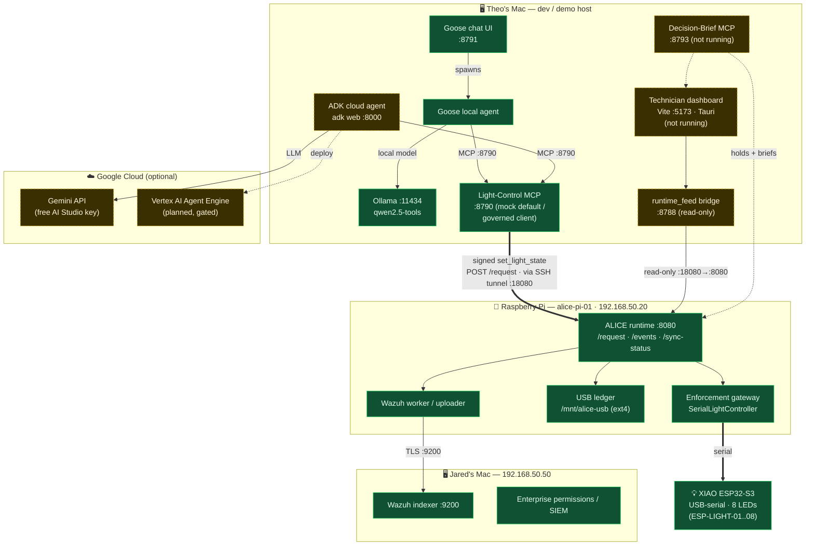

# Before machine-metrics reconciliation

Historical context from upstream `237c307`, preserved before updating the active integration map.
These host/status claims were supplied by the earlier author, not reverified in this session.

## docs/agent-build/STATUS.md

# Agent demo — status (2026-09-06)

Agents share one MCP, **repurposed from lights to machine-metrics**: they read
`{fan_speed, server_temperature, power_consumption}` and write only `fan_speed`.
Dev runs off a local state file; the real path is the Pi state file governed
through ALICE. The standalone live-demo/agent-loop prototype has been extracted
to a separate folder outside this repo (`../test-simulation/`).

| # | Project | Status | Blocker / next |
| --- | --- | --- | --- |
| 1 | **Cloud agent** — Google ADK + Gemini | 🟡 Verified earlier vs the *light* MCP; now **stale** vs the metrics contract | `cloud/adk_light_agent/` still instructs `set_machine`/`blink`, which no longer exist. Repoint to `get_metrics`/`set_fan_speed` (or a read-only "flashing" role) before demoing. Vertex/Agent Engine still gated behind the human checkpoint. |
| 2 | **Local agent** — Goose + Ollama | 🟢 Verified (interactive) | Chat at `http://127.0.0.1:8791`. Will see the new metrics tools on reconnect. |
| 3 | **Machine-metrics MCP** — `services/light_mcp/` | 🟢 Rewritten & running | Streamable HTTP `:8790`, tools `get_metrics` + `set_fan_speed`, state file on the Pi. `poller.py` (10 Hz read). Legacy light drivers (`drivers.py`, `machines.yaml`) dormant. |

## Local model (dashboard + local agent)
🟢 **Ollama up** on `:11434` with `qwen2.5-tools` (4.7 GB, custom tool-calling build) and base `qwen2.5`. Tool-calling **verified** through Goose.
🟡 **Dashboard not yet pointed at it:** `ALICE_LLM_MODEL` is empty and `ALICE_BIOMETRIC_MODE=mock` (ArcFace/InsightFace available but `ALICE_INSIGHTFACE_ROOT` unset). The model is ready on the host; the technician dashboard's LLM/biometric hooks still need wiring.

## Running now
`:8790` machine-metrics MCP · `:8791` Goose chat · `:11434` Ollama · `:8000` `adk web`.
Not running: technician dashboard, Decision-Brief MCP.
The live demo runs from `../test-simulation/` (standalone, outside this repo).

## To drive the real 8 lights (governed)
Tunnel to the Pi, set `LIGHT_DRIVER=alice` + `ALICE_AGENT_ID`/`ALICE_AGENT_KEY_FILE` (provisioned seed), restart the MCP. See `docs/agent-build/03-light-mcp.md` and `docs/integration/esp-handoff.md`.

## Notes
- Nothing committed yet (all on branch `feat/light-mcp`, up to date with `main` @ `3bceeac`).
- A 4th project appeared on `main` — **Decision-Brief MCP** (`services/brief_mcp/`, `:8793`, `docs/agent-build/04-brief-mcp.md`) — not built or verified here.
- Build doc `03-light-mcp.md` is slightly stale (predates the 8-light + governed drivers).

## docs/agent-build/topology.md

# Where everything runs — deployment topology (2026-09-06)

Maps the hosts behind [STATUS.md](STATUS.md): which agents / MCP servers / ALICE
runtime live where, and how they talk. These are **physical hosts** (two Macs, a
Pi) + one USB device + optional Google Cloud — not VMs.

## Host / process map

| Host | Runs today | Planned / optional |
| --- | --- | --- |
| **Theo's Mac** (dev/demo) | Goose agent, chat UI `:8791`, Light MCP `:8790` (mock), Ollama `:11434` | ADK cloud agent (`adk web :8000`), dashboard (Vite `:5173`), `runtime_feed :8788`, Brief MCP `:8793` |
| **Raspberry Pi** `alice-pi-01` (`192.168.50.20`) | ALICE runtime `:8080`, enforcement + `SerialLightController`, USB ledger, Wazuh worker | Light MCP in `esp` mode could run **here** instead (direct serial, bypasses gate) |
| **XIAO ESP32-S3** | 8 LEDs over **USB-serial to the Pi** (no IP, no network) | real power-grid schema |
| **Jared's Mac** (`192.168.50.50`) | Wazuh indexer `:9200`, enterprise permissions/SIEM | — |
| **Google Cloud** | Gemini API (free AI Studio key) — called by the ADK agent | Vertex AI Agent Engine deploy (gated behind human checkpoint) |

## The one that moves: the Light MCP
- **`mock`** (now) — on the Mac, no hardware, no Pi.
- **`alice`** (recommended) — MCP stays on the **Mac**, signs requests, and lets **ALICE on the Pi** decide/enforce/audit → light. Only needs to *reach* the Pi (SSH tunnel `:18080`→Pi `:8080`).
- **`esp`** (bench) — MCP runs **on the Pi** and drives the XIAO over serial directly; bypasses the ALICE gate.

_Green = running/verified · dashed amber = planned or not yet started._

