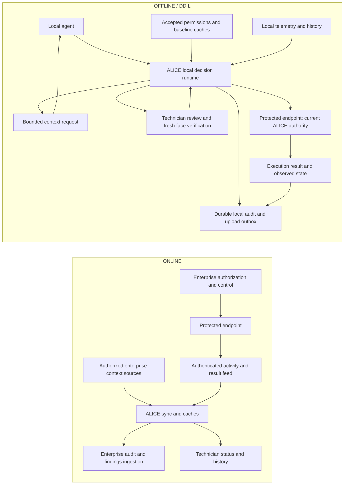

# ALICE — architecture and integration boundaries

**Updated:** 2026-09-05. **Product:** Authenticated Local Identity & Cyber Enforcement.
**Status:** Revised design; implementation evidence is identified separately below.

> ALICE synchronizes trusted enterprise context while online, governs local
> autonomous-agent actions while offline, and returns an accountable record of
> disconnected activity when enterprise connectivity recovers.

This revision follows Jared's latest two-mode product definition and explicit
choice that **enterprise systems control execution directly online**. It replaces
this document's earlier always-inline DCAMR design. The supplied Technician
Console `HANDOFF.md` informs the workstation boundary; its reported implementation
is in a separate repository and has not been independently audited here.

Read with the [product PRD](ALICE-DCAMR-PRD.md),
[developer handoff](ALICE-DCAMR-PRD-Handoff.md),
[console integration guide](../technician-console-integration.md), and
[implementation tracker](../implementation-tracker.md).

## 1. Product names, modes and authority

ALICE names the whole product. DCAMR remains a legacy name for the Pi runtime and
existing `dcamr/` code. **Permissions** is the current product term for the rules
previously called policy: user/agent roles, delegation, mission scope, permitted
operations, approval requirements and hard prohibitions.

Existing `policy` JSON keys, package names and `dcamr.*` event aliases are
compatibility concerns, not an instruction to rename working code in this docs
revision. Coordinate any wire/storage migration with the console adapter and
shared schema owners. The console handoff reports normalization to `alice.*`.

There are exactly two product modes:

| Mode | Execution authority | ALICE responsibility |
| --- | --- | --- |
| **ONLINE** | Enterprise systems authorize and control protected actions directly. | Synchronize trusted local caches, consume authenticated activity feeds, preserve provenance and send local audit/findings upstream. ALICE is not a mandatory online action gateway. |
| **OFFLINE / DDIL** | ALICE governs supported local-agent actions after the protected execution path has transferred authority to it. | Use last accepted permissions/baselines plus local evidence, telemetry/history and technician review; authorize or block each local request and audit its outcome. |

Reconnection, synchronization and control transfer are workflows/readiness
indicators, not a third product mode. An internet link becoming available does
not establish that required enterprise services are authenticated, current or
ready to resume control. Conversely, a single optional evidence source failing
need not transfer execution authority. The required-service set, health thresholds,
hysteresis and authority-transfer protocol remain implementation decisions.

A failed or ambiguous transfer never means that both parties can execute. The
execution boundary must reject commands until it can identify a valid current
authority. This is a required property, not an implemented automatic failover.

## 2. Components and responsibility

| Component | Responsibility | Boundary |
| --- | --- | --- |
| Enterprise authorization/control systems | Primary ONLINE action control; authoritative permissions and delegated scopes. | Enterprise control reaches the protected endpoint directly; ALICE does not independently approve each online action. |
| Enterprise context adapters | Fetch authorized permissions, normal-behavior releases, mission context and relevant SIEM/EDR records; upload audit/findings. | A SIEM may aggregate these sources. Its transport alone does not make every event a permission or a trusted normal training sample. |
| ALICE Pi | Synchronization/cache manager and audit participant online; local decision authority offline. | Protect credentials, accepted caches, model, local history and durable audit from agent modification. |
| Agent Mac / local agents | Propose requests and supply bounded supporting context. | During OFFLINE, no direct protected-control bypass. Claimed user/mission/identity must be checked against trusted mappings. |
| Protected motor/system controller | Execute a valid current-authority command once; report actual execution and available telemetry. | Enforce control ownership and idempotency at the execution boundary, including stale enterprise and stale ALICE commands. |
| Technician Mac | Display supplied state and provenance; explain it with a local LLM; authenticate technicians; submit exact-request review actions. | Does not run the Pi's anomaly/permissions/fusion logic or claim that a submitted approval executed a command. |
| Removable USB and local storage | Persist accepted context and locally generated audit/outbox state. | Trusted inputs and generated outputs have separate permissions, validation and retention rules. |

The physical LAN uses a switch connecting the Pi, Agent Mac, Technician Mac and
protected controller. The router uplink supplies enterprise/cloud connectivity.
The confirmed decision node is a **Raspberry Pi 4 Model B with 2 GB RAM and OS
Lite**. The motor controller is still a second Pi or ESP choice; no GPIO or
controller protocol is implemented in this repository.

## 3. Data flow in each mode



These are logical flows, not a requirement to route all Ethernet traffic through
the Pi. Network adjacency, IP allowlists or hiding an endpoint from the agent are
insufficient to establish exclusive control ownership.

### ONLINE activity visibility

ALICE receives activity through agreed enterprise/controller feeds because
ONLINE execution bypasses it. That contract needs event IDs, source identity,
cursors, ordering, replay and explicit coverage/gap reporting. It must distinguish
requests, authorizations, execution attempts, confirmed results and observations.
ALICE must not manufacture a complete online audit trail when its feed is partial
or disconnected. The enterprise remains responsible for its online execution log;
ALICE records the feed coverage it actually received.

### OFFLINE local decision path

For each admitted local request, the Pi must:

1. Authenticate the caller and resolve agent, responsible user/delegator and
   mission from trusted identity/permissions data; preserve unresolved attribution.
2. Normalize and bind the exact request, parameters, target and history snapshot.
3. Evaluate deterministic permissions from usable trusted data. A hard prohibition
   returns `DENY` without invoking the anomaly model or permitting a context/
   technician override; model unavailability must not prevent that denial.
4. For otherwise eligible requests, confirm ALICE's current execution ownership,
   usable required caches/model/reference and audit capacity. Missing prerequisites
   cannot create an allow path.
5. Build bounded behavioral features and combine anomaly observations with
   required evidence, mission context and available telemetry.
6. Produce `ALLOW`, `REQUEST_CONTEXT`, `HOLD` or `DENY`, recording the sources and
   information available at that time.
7. Forward only a currently authorized exact request, using idempotent execution
   binding. Record controller receipt, completion and observed effect separately.

This orchestration is planned. The current implementation supplies anomaly
components and lab experiments; it does not execute this whole sequence.

## 4. Controlled transfer of execution authority

The user's direct-enterprise ONLINE choice makes a coordinated transfer necessary.
A disconnected Pi and enterprise service must not both believe their commands
are executable. The protected endpoint or a trusted controller/broker must enforce
one current authority using an agreed authenticated fencing/lease protocol.

Required behavior:

- On ONLINE → OFFLINE, stop accepting enterprise commands from the previous
  authority interval before accepting ALICE commands. Establish local readiness;
  connectivity loss itself does not grant permission to execute.
- On OFFLINE → ONLINE, authenticate recovered services, establish their readiness,
  resolve/fence commands already accepted for execution, retire local admission
  authority and obtain confirmation of enterprise ownership before resuming its
  command path. Avoid an unbounded wait on audit uploads; retained outbox entries
  can continue draining after a safe transfer.
- Bind queued commands, authorizations and technician proofs to their request and
  authority interval. Reject stale, duplicated or superseded commands even if
  they arrive late through a recovered network.
- Preserve pending reviews and decisions as history. An old local approval is
  not automatically valid under enterprise ownership or refreshed permissions.
  Any later execution requires evaluation by the current authority.
- Do not infer completion from a timeout. Recover the existing command's result
  or record uncertainty; do not send a second execution with a new ID.
- On boot, flapping links, unavailable controllers or failed transfer, expose
  readiness/ownership uncertainty and block unsupported execution paths.

The precise owner of the fence, transfer messages, lease expiry, clock assumptions
and acknowledgements must be agreed by core, enterprise and controller teams.
The demo must identify simulated transfer behavior until this boundary is tested.

## 5. Trusted cache synchronization

"Sync everything" means cover the required context categories with bounded,
mission-relevant data on this 2 GB node. It does not require an unbounded mirror
of enterprise logs or raw training history.

| Cache | Contents and authoritative source | How OFFLINE uses it |
| --- | --- | --- |
| Permissions | Authorized enterprise identity/permissions service or its authenticated export: users, agents, delegation, roles, mission scope, hard bounds, required review and revocations. | Deterministic eligibility and agent-to-user attribution. |
| Normal behavior | Approved baseline release: supported profiles, normal counts/sequences, target relationships and agreed physical behavior summaries. | Fixed feature comparisons and compatible anomaly input. |
| Mission/evidence context | Relevant authenticated SIEM/EDR/mission records with timestamps, source and verification state. | Available evidence and context; stale or unavailable records retain those labels. |
| Model/reference metadata | Separately approved frozen model, feature profile and calibration identities. | Compatibility checks and offline inference readiness; synchronization does not fit a new model. |

Every accepted cache generation needs issuer/source identity, schema version,
content digest, version/freshness metadata, validity rules and compatibility
bindings. Authenticate the transport and verify the release's signature/allowed
issuer where required. A self-computed hash or an agent-provided `verified=true`
flag cannot establish trust.

Stage a candidate update outside the active set; bound its bytes and validate it
fully before atomic activation. Keep a permitted last-known-valid generation when
a new candidate fails, and expose why the update was rejected. Expiry, rollback
rules and any offline grace must be explicit mission requirements; no silent
extension or rollback. In-flight work keeps its captured provenance, but current
authority and active permissions must be checked before execution.

Synchronization is handled **directly between the Pi and authenticated enterprise
interfaces**. The technician reviews exceptions and findings; they are not the
manual transport for ordinary cache refresh or audit uploads. The trusted update
service's authority to write removable inputs, and its separation from the
unprivileged decision worker, remain to be agreed before implementation.

## 6. One USB, distinct input and output lifecycles

The desired product layout reflects the permissions terminology:

```text
DCAMR_USB/
  permissions/       # verified externally governed input
  normal_behavior/   # verified baseline/model-reference release inputs as agreed
  audit_logs/        # ALICE-generated append output
```

This is a target layout. The earlier `policy/` directory, `packages/mission_policy/`
and existing `policy` wire keys remain legacy identifiers until a coordinated
migration; no media is renamed or formatted by this documentation update.

The decision process reads accepted input snapshots. Only an authorized update
path may replace releases after validation. Audit appends must not alter the
signed input-package hash set. Filesystem permissions and separate service
identities must enforce the distinction; folder labels alone do not.

USB removal must not erase the only authoritative record of prior actions.
Specify durable local audit/outbox staging and/or trusted checkpoints, bounded
retention, reconnect recovery and disk-full behavior. An unavailable required
cache or inability to durably record a consequential action must produce an
explicit blocked state under the mission's failure rules. USB write ownership,
retention quotas and removal/fallback details are open implementation decisions.

## 7. Local anomaly model and limits

The current model is **scikit-learn Isolation Forest**, trained on the Mac with
64 trees, 256 samples per tree, 11 float32 cyber features, seed 1729, one worker and
numerical-library threads limited to one. It is not an LLM. The current corpus is
synthetic Web-01 activity; fitting uses 3,600 normal requests, with separate normal
calibration and evaluation sessions and challenge scenarios.

The [feature builder](../anomaly-features.md) covers agent/action/target familiarity,
endpoint relationships, action frequency, five-minute proposal/execution counts
and unsmoothed action-transition frequency. Authenticated agents without a personal
baseline can use an exact role/mission cohort while retaining novelty. These
comparisons and flags remain distinct from learned forest scores.

The [training experiments](../anomaly-training.md) map `score_samples` to a
normal-tail rank. Separate diagnostic/change references improved legitimate-change
bands on fresh synthetic requests (32/68 elevated/high → 2/68), but all 20 unseen
endpoints still received low conditional ML bands. Explicit novelty cannot be
suppressed by a low score. The percentile is not a compromise probability or
permission; failed/unavailable evaluations have null scores.

No deployable model is saved, no model boots on the Pi, and no actual Pi resource
acceptance has run. Motor requests need a separately versioned feature/profile
contract: absolute versus relative angle, normal/hard limits, action rate and
measured-state availability remain unresolved. Cyber features cannot be silently
reused for servo angles. Online cache refresh must not learn normality from
arbitrary live events or automatically retrain from technician approvals.

## 8. Decision, context and reassessment semantics

The four existing core machine outcome names remain `ALLOW`, `REQUEST_CONTEXT`,
`HOLD`, `DENY`. UI copy may say "request more context", "hold for technician" or
"reject"; a machine `DENY`, a technician `REJECT`, and an execution result are
different records. These local machine outcomes apply to OFFLINE governance.
Online records must identify enterprise authority rather than pretending to be
local anomaly decisions.

A bounded context challenge identifies the exact request/assessment and required
fields. A new agent, unsupported justification or modest anomaly can trigger a
challenge when permissions allow that path. Hard prohibitions do not enter the
loop; high anomaly need not receive a context round before HOLD. Attempt limits,
response deadlines and evidence requirements must be settled with fusion.

Agent prose is a claim. Verify relevant evidence against trusted sources and
record missing, stale, unverifiable or contradicted evidence explicitly. An absent
external response is not proof that an event is false. Context alone cannot
manufacture telemetry, change request parameters, or lower a fixed behavioral
score. The current cyber builder pins the original behavioral snapshot for a
context-only retry.

After accepted new context/evidence, the authoritative offline core issues a new
immutable assessment linked to the same request. Preserve the original and all
successors; never let the console/LLM calculate a replacement decision.

The console handoff reports `REASSESSMENT_PENDING` after an agent response until a
new `alice.decision` arrives. Its optional lineage uses `previous_decision_id`,
`root_decision_id`, `trigger` and positive `sequence`. It currently requires a
linear, known-parent, same-request/agent/mission/action/target chain. Parent replay,
competing assessments and binding all parameters/digests still require a shared
protocol. New assessments invalidate old grants/actions and block open dialogs;
late receipts remain attached to the historical action.

## 9. Technician console and facial verification

The separate `ALICE_TechnicalReview` handoff reports a native Mac application:
React/TypeScript with Rust/Tauri 2 and SQLite, a local FastAPI/InsightFace/ArcFace
service using `buffalo_l` ONNX assets on CPU, and local Ollama with `llama3.1:8b`.
These workloads stay on the Technician Mac. They do not belong on the 2 GB Pi.

The console displays supplied decisions, evidence, provenance, activity, package
and service state, immutable history and research explanations. Its LLM has no
authorization tools and cannot invent readiness, verification or execution facts.

"Face ID" in the product discussion means **local facial identity verification**
in this implementation. It is not Apple's Face ID. ArcFace matching does not
establish liveness, camera replay resistance or deepfake detection.

For an offline held action, the required review sequence is:

1. Technician signs into an authorized local session and selects the latest
   assessment for the exact request.
2. Console presents only capabilities supplied by the authoritative core:
   `APPROVE_ONCE`, `HOLD`, `RESEARCH`, `REJECT` as applicable.
3. Consequential approval requires fresh facial verification; login alone is
   insufficient. The console handoff's native grant expires after 60 seconds and
   binds one technician to one decision/request for one use.
4. Console submits an authenticated approval request. The Pi independently checks
   the proof, current permissions, exact parameters, latest assessment and current
   execution authority before accepting it. A hard prohibition remains binding.
5. Acceptance/denial, execution receipt, execution completion and actual observed
   effect are recorded separately. The existing console receipt declares
   `NOT_EXECUTED`; it is not motor confirmation.

The handoff reports real enrollment/login and automated native ArcFace/Ollama
checks, plus mock-edge reassessment/approval flows. Live camera approval and
negative operator cases still need acceptance. Remote native transport, durable
outbox/receipts and cryptographically verifiable remote approval attestation are
unfinished. A local UUID or renderer boolean is not a Pi-verifiable identity proof.

During ONLINE, this offline approval path must not independently authorize an
enterprise-controlled action. Show current authority, cache/feed freshness and
pending synchronization distinctly from historical decision-time mode. Any future
enterprise review integration needs its own agreement. See the
[console integration guide](../technician-console-integration.md) for reported
contracts, gaps, identity lifecycle and operator acceptance.

## 10. Audit, accountability and execution evidence

OFFLINE audit covers every request, including malformed/blocked requests where
possible, each assessment, challenge/response, technician action, attempted
execution, confirmed result, telemetry observation, cache activation and authority
transition. Use bounded records and explicit failure handling; a log write that
failed is not recorded as durable success.

Records must preserve:

- Agent identity, authenticated requester, responsible user/delegator mapping,
  mission and the source/version establishing that relationship. Agent-supplied
  ownership claims do not prove attribution; unknown mappings remain explicit.
- Stable request/assessment/action/execution/event IDs, parameter binding,
  decision-time mode/authority, ordering, UTC availability and monotonic durations.
- Captured permissions/baseline/model/reference identities, evidence availability
  and verification state, telemetry freshness, factor sources and reason codes.
- Technician identity/proof metadata and exact scoped action, without camera frames,
  embeddings, passwords or bearer tokens in enterprise decision records.
- Separate request, authorization, attempted execution, completion and observed
  consequence. A denied dangerous request must not be reported as an executed one.

Append reassessments and reconciliation as linked events. Never replace original
risk, permission results, context availability or outcomes with later knowledge.
A hash chain provides tamper evidence relative to retained trusted checkpoints;
it does not stop wholesale deletion by itself. The console's local SQLite audit
is distinct from the Pi's mission audit and is not reported as tamper-evident.

A controller's last commanded position or `SUCCESS` response is not independently
measured position. Record telemetry's actual source and unavailable physical
feedback rather than fabricating a sensor reading.

## 11. Reconnection, upstream reporting and cache refresh

The Pi communicates directly with configured enterprise interfaces. The sequence
may overlap where safe, but must preserve these independently visible results:

1. Reauthenticate required services and establish connector/authority readiness;
   a successful ping or router link is insufficient.
2. Resume durable audit delivery using stable event IDs/cursors and bounded
   retries. Retain unacknowledged records across crashes and intermittent links.
3. Prioritize potentially dangerous activity: high anomalies, unresolved evidence,
   scope-limited technician approvals, failed/unexpected effects and discrepancies.
   Send all DDIL audit history through the reliable stream as well; alert priority
   does not authorize discarding ordinary allowed/blocked activity.
4. Query missing enterprise evidence and append verified/not-found/contradicted
   findings with source/freshness context. Report discrepancies to enterprise and
   technician without rewriting the original decision.
5. Download and validate current authorized permissions, normal behavior and
   relevant context; activate compatible cache generations atomically.
6. Complete the fenced return to enterprise execution. Continue any retained
   upload backlog with its own acknowledged cursor; ONLINE is not a claim that
   every historical event has already reached the enterprise.

Separate audit upload acknowledgement, evidence reconciliation completion, cache
activation and execution ownership in status. A retry must not reexecute a command
or turn an old technician approval into a new authorization. Connector schemas,
credentials, acknowledgements, retention and delivery guarantees remain to be
implemented and tested; no specific enterprise vendor is integrated today.

## 12. Pi resource and offline-readiness requirements

| Area | Implemented boundary or proposed target |
| --- | --- |
| Hardware | Confirmed Pi 4, 2 GB RAM, OS Lite; OS bitness, other services, power/cooling and actual performance still need measurement. |
| Work placement | Mac training, facial verification and LLM; Pi performs bounded cache/decision/audit work and frozen-model inference when implemented. |
| Existing input bounds | Baseline payload ≤8 MiB; feature bundle ≤1 MiB; normalized action/result each ≤16 KiB; 11 cyber features. |
| Existing history bounds | 300 seconds, up to 1,024 proposal and 1,024 execution deliveries, at most 32 sessions per supplied snapshot. Persistent history ownership is not implemented. |
| Proposed inference | One preloaded scoring worker, one request in flight, numerical/inference threads limited to one. |
| Proposed memory | Worker steady RSS ≤256 MiB, load peak ≤384 MiB; model ≤16 MiB uncompressed. Total Pi service usage must also fit. These are unmeasured targets. |
| Proposed request service | p95 ≤100 ms at nominal 1 request/s; at most 8 queued requests and a 500 ms deadline from admission to result, including queue time. Supervision and hardware acceptance remain unimplemented. |
| Synchronization | Bounded pages/batches and disk-backed outbox; explicit cache/outbox quotas, retry budgets and disk-full behavior still to be specified. |

Offline readiness requires accepted compatible caches/model, trusted local state,
usable audit storage and confirmed control ownership. Missing or expired required
inputs must not quietly become normal scores or permission grants. An unavailable
LLM does not remove manual review; required face-verification failure blocks that
approval path. Cloning code does not provision model weights or local identities.

## 13. Implementation evidence and next integration work

| Area | Evidence at this revision |
| --- | --- |
| Core anomaly contract/features | Implemented schemas, strict validation/binding, fixed cyber features, source provenance and replay fixtures. |
| Mac model experiments | Implemented synthetic fitting and global/conditional calibration comparisons; published JSON reports. |
| Core validation | 103 tests and both fixture replays passed on the previously published implementation. This revision changes documentation only. |
| Core lifecycle/execution | ONLINE/OFFLINE control, synchronization/connectors, durable mission audit, permissions/fusion/context orchestration, controller execution and Pi deployment remain unimplemented. |
| Technician console | Status above is reported by supplied `HANDOFF.md`, dated 2026-09-05, for a separate repository; not independently tested in this checkout. |
| Cross-repository integration | Event adapter, source authentication, remote proof, durable delivery/receipts, execution results and mode/authority changes remain open. |

Next integration milestones are the mode/authority contract, enterprise cache/feed
adapter, permissions/input schema agreement, console/core event/proof compatibility,
offline request-to-audit loop, motor/controller contract and two-direction recovery
tests. Preserve the working cyber regression profile while agreeing motor semantics.
The [developer handoff](ALICE-DCAMR-PRD-Handoff.md) assigns those boundaries and the
[demo runbook](../demo-runbook.md) separates current runnable checks from future
end-to-end acceptance.
