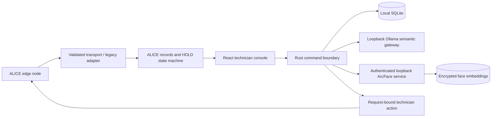

# Console architecture

ALICE is the whole system; `workstation/` is its technician console subsystem. The main [architecture](../../../docs/prds/ALICE-DCAMR-Architecture.md) and [console integration requirements](../../../docs/technician-console-integration.md) govern product behavior. The preserved dashboard payloads define existing legacy inbound examples, and the Europa image informs only visual craftsmanship.

The existing DDIL/CONNECTED/DEGRADED schema and fixture display are retained. Main product modes are ONLINE (enterprise execution) and OFFLINE (local ALICE execution after controlled transfer). A connection flag, mock/remote transport setting or face match does not establish the current control owner. The authenticated transfer protocol and direct Pi-to-enterprise synchronization remain future integration work; see the [migration assessment](../integration/main-repository-migration.md). The implementation uses its own shield identity, decision workspace, agent network, evidence ledger, and explicit action bar.

Mock transport is fully functional. `RemoteAliceTransport` is intentionally fail-closed pending the team's WebSocket/REST protocol, authentication, and receipts. The renderer cannot seed trusted remote decisions through the mock cache command. Real integration must validate and cache remote records at the native transport boundary before allowing an action command. It must not make a frontend POST into an authorization bypass.

The UI never calculates upstream policy results, anomaly scores, confidence, or evidence verification. Its risk dial visualizes the supplied 0–100 score; counts reflect supplied events. `alice.service_status` and `alice.agent_status` remain separate. Runtime language status comes from the native health check, and context status comes from the deterministic application workflow.

SQLite contains console identities, enrollment metadata, immutable decision snapshots, response/reconciliation annotations, technician requests, settings, and local audit events. Session credentials and single-use approval grants remain native memory. Mock and remote databases have separate default filenames. Read history only after native technician authentication. Audit presentation/export is scoped to the latest 500 local records; this is not a substitute for the authoritative upstream mission audit.

The HTTP clients are loopback-only, disable redirects, have timeouts, and never expose the service token to React. No shell, arbitrary filesystem, or generic HTTP plugin is available to the renderer. Local same-user compromise remains outside this hackathon boundary: the database is access-restricted, not a hardware-backed trust anchor.

## Contract ambiguities retained

- The supplied `.json` file is prose with three JSON objects. The original is preserved byte-for-byte; extracted JSON changes formatting only.
- The original request opens outbound access while its agent justification says it will prevent communication. The console flags this inconsistency without changing the request or policy outcome.
- `unverified` includes the externally pending references in the example; the UI does not add those counts together.
- Node display normalizes the known `DCAMR-` prefix to `ALICE-`. IDs for decisions, requests, agents, evidence, and packages remain unchanged.
- Existing decision IDs are immutable. Conflicting payloads with the same ID are rejected. Upstream reassessment requires a new decision ID with validated parent/root/trigger/sequence lineage. Request indexes are reconstructed from the immutable snapshots; old workflows are superseded. See the HOLD workflow document.
